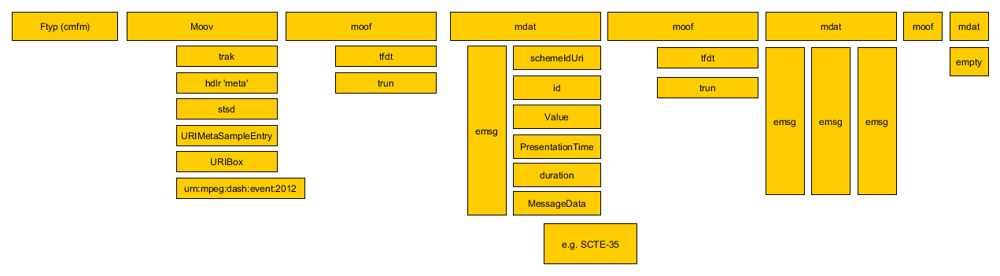
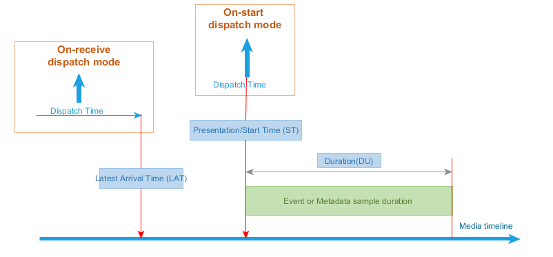
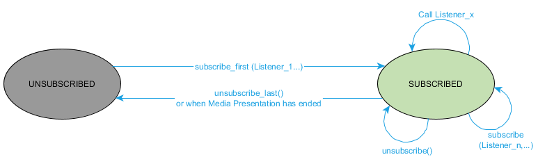

# DASH Player architecture for processing DASH events and timed metadata tracks # {#event-architecture}

<a href="#player-event-architecture">This Figure</a> demonstrates a generic architecture of DASH Player including DASH Events and timed metadata tracks processing models.

<figure class="figure" id="player-event-architecture">
	
    <figcaption class="figure">DASH Player architecture including the inband Event and Application-related timed metadata handling</figcaption>
</figure>

In the above figure:

1. DASH Player processes the received MPD. The manifest information including the list of events schemes and values, and timed metadata track schemes are passed to Application.

2. Application subscribes to the event and timed metadata track schemes in which it is interested, with the desired dispatch mode. 

3. If the manifest includes any MPD Events, the DASH Player parses them and appends them to the Event & Timed Metadata Buffer.

4. Based on the MPD, the DASH Player manages the fetching and parsing of the Segments before appending them to the Media Buffer.

5. Parsing a Segment includes:
    
    1. Parsing the high-level boxes such as Segment Index (sidx) and Event Message boxes, and appending Event Message boxes to the Event & Metadata Buffer.
    2. For an Application-related timed metadata track, extracting the data samples, and appending them to Event & Metadata Buffer.
    3. For media segments, parsing the segments and appending them to the Media Buffer.

6. Event & Metadata Buffer is a FIFO buffer, passing the events and timed metadata samples to Event & Metadata Synchronizer and Dispatcher function.

7. The DASH Player-specific Events are dispatched to DASH Player's Control, Selection & Heuristic Logic, while the Application-related Events and timed metadata track samples are dispatched to the application as the following. If an Application is subscribed to a specific Event or timed metadata stream, dispatch the corresponding event instances or timed metadata samples, according to the dispatch mode:
    1. For [=on-receive=] dispatch mode, dispatch the Event information or timed metadata samples as soon as they are received (or no later than <var>AT</var>).
    2. For [=on-start=] dispatch mode, dispatch the Event information or timed metadata samples at their associated presentation time, using the synchronization signal from the media decoder.

# Event and Timed metadata sample timing models # {#event-metadata-timing}

## Inband Event timing parameters ## {#Inband-event-timing}

Figure 2 presents the timing of an inband Events along the media timeline:
<figure class="figure">
	
    <figcaption class="figure">The inband event timing parameter on the media timeline</figcaption>
</figure>

As shown in Figure 2, every inband Event can be described by three timing parameters on the media timeline:

1. Event Arrival Time (<var>AT</var>) which is the earliest presentation time of the Segment containing the Event Message box.

2. Event Presentation/Start Time (<var>ST</var>) which is the moment in the media timeline that the Event becomes active.

3. Event duration (<var>DU</var>): the duration for which the Event is active

An inband Event is inserted in the beginning of a Segment. Since each media segment has an earliest presentation time equal to (<var>AT</var>), <var>AT</var> of the Segment carrying the Event Message box can be considered as the location of that box on the media timeline. DASH Player has to fetch and parse the Segment before or at its <var>AT</var> (at <var>AT</var> when it's assumed that the decoding and rendering of the segment incurs practically zero delay). Therefore, the Event inserted in a Segment at its <var>AT</var> time will be ready to be processed and fetched no later than <var>AT</var> on the media timeline.

The second timing parameter is Event Presentation/Start Time (<var>ST</var> ). <var>ST</var> is the moment in the media timeline that the Event becomes active. This value can be calculated using the parameters included in the DashEventMessageBox.

The third parameter is Event Duration (<var>DU</var> ), the duration for which the Event is considered to be active. <var>DU</var>  is also signaled in the Event Message box using a specific value.

## Dash Event message box format and event timing parameters ## {#emsg-format}

Table 1 shows the DASHEventMessageBox emsg box format defined in MPEG DASH:

<figure class="table">
<table class=MsoTableGrid border=1 cellspacing=0 cellpadding=0 bgcolor="#DDDDDD"
 style='border-collapse:collapse;border:none'>
 <tr>
  <td width=623 valign=top style='width:600pt;border:solid #4472C4 2.25pt;
  padding:0in 5.4pt 0in 5.4pt'>
<table>
<tr>
 <td colspan="4">aligned(8) class DASHEventMessageBox extends FullBox (‘emsg’, version, flags = 0){</td>
</tr>
<tr><tr  class="odd">
<td></td>
<td colspan="2">if (version==0) {</td>
<td></td>
</tr></tr>

<tr class="even">
<td></td>
<td></td>
<td>string</td>
<td>scheme_id_uri;</td>
</tr>
<tr class="odd">
<td></td>
<td></td>
<td>string</td>
<td>value;</td>
</tr>
<tr class="even">
<td></td>
<td></td>
<td>unsigned int(32)</td>
<td>timescale_v0;</td>
</tr>
<tr class="odd">
<td></td>
<td></td>
<td>unsigned int(32)</td>
<td>presentation_time_delta;</td>
</tr>
<tr class="even">
<td></td>
<td></td>
<td>unsigned int(32)</td>
<td>event_duration;</td>
</tr>
<tr class="odd">
<td></td>
<td></td>
<td>unsigned int(32)</td>
<td>id;</td>
</tr>
<tr class="even">
<td></td>
<td colspan="2">} else if (version==1) {</td>
<td></td>
</tr>
<tr class="odd">
<td></td>
<td></td>
<td>unsigned int(32)</td>
<td>timescale_v1;</td>
</tr>
<tr class="even">
<td></td>
<td></td>
<td>unsigned int(64)</td>
<td>presentation_time;</td>
</tr>
<tr class="odd">
<td></td>
<td></td>
<td>unsigned int(32)</td>
<td>event_duration;</td>
</tr>
<tr class="even">
<td></td>
<td></td>
<td>unsigned int(32)</td>
<td>id;</td>
</tr>
<tr class="odd">
<td></td>
<td></td>
<td>string</td>
<td>scheme_id_uri;</td>
</tr>
<tr class="even">
<td></td>
<td></td>
<td>string</td>
<td>value;</td>
</tr>
<tr class="odd">
<td></td>
<td colspan="2">}</td>
<td></td>
</tr>
<tr class="even">
<td></td>
<td colspan="2">unsigned int(8)</td>
<td>message_data();</td>
</tr>
<tr class="odd">
<td colspan="4">}</td>
</tr>
</tbody>
</table>
 

  </td>
 </tr>
</table>
<figcaption class="table">The emsg box format and parameters</figcaption>
</figure>

Note: In the table above, parameters with timescale_v0 and timescale_v1 are same parameters. The additional suffixes are for purpose of clear refenencing in the equation below.  These parameters are defined as [=timescale=] in [[!MPEGDASH]].

The <var>ST</var> of an event can be calculated using values in its emsg box:

<figure class="equation">

$$ST = \begin{cases}
AT + \frac{presentation\_time\_delta}{timescale\_v0} \space
\qquad\qquad\qquad\qquad\qquad\qquad\qquad\qquad\qquad\qquad  version=0\\ 
PeriodStart +  \frac{SegmentBase@presentationTimeOffset}{SegmentBase@timescale} + \frac{presentation\_time}{timescale\_v1}\qquad \qquad version=1
\end{cases}
$$

<figcaption class="equation">Event Start Time of an inband event</figcaption>
</figure>

Where <var>PeriodStart</var> is the corresponding Period‘s start time, and [=SegmentBase@presentationTimeoffset=]" and [=SegmentBase@timescale=] belong to the corresponding Represenation.

Note: <var>ST</var> is always equal to or larger than <var>AT</var> in both versions of emsg.

Note: Since the media sample timescales might be different than emsg's timescale, <var>ST</var> might not line up with a media sample if different timescales are used.

Note: If various Adaptation Sets carry the same events, different Adaptation Sets/Representations with different PTOs, the [=presentation_time_delta=] and/or [=presentation_time=] values might be different per Adaptation Set/Representation, i.e. the same emsg box can not be replicated over multiple Representations and/or Adaptations Sets. Therefore, the use of same PTOs cross Adaptation Sets/Representations which carry the same events is encouraged.

Note: In the case of [=CMAF=], <var>PeriodStart</var> is the CMAF track's earliest presentation time. If during the segment creation, this time is not known, it is recommeded to use the [=presentation_time_delta=].

In this document, we use the following common variable names instead of some of above variables to harmonize parameters between Inband events, MPD events, and timed metadata samples:

- <var>scheme_id</var> = [=scheme_id_uri=]
- <var>value</var> = [=value=]
- <var>presentation_time</var> = <var>ST</var>
- <var>duration</var> = [=event_duration=]/[=timescale=]
- <var>message_data</var> = [=message_data()=]

## MPD Events timing model ## {#mpd-event-timing}

MPD Events carry a similar data model as inband Events. However, the former type is are carried in the MPD, under the Period elements. Each Period event has <{EventStream}> element(s), defining the [=EventStream@schemeIdUri=], [=EventStream@value=] , [=EventStream@timescale=] and a sequences of <{Event}> elements. Each event may have [=Event@presentationTime=], [=Event@duration=], [=Event@id=] and [=Event@messageData=] attributes, as shown in Table 2.

<figure class="table">
<table class=MsoTableGrid border=1 cellspacing=0 cellpadding=0
 style='border-collapse:collapse;border:none'>
 <tr>
  <td width=623 valign=top style='width:800pt;border:solid #4472C4 2.25pt;
  padding:0in 5.4pt 0in 5.4pt'>
  <table class=MsoNormalTable border=1 cellspacing=0 cellpadding=0 width="99%"
   style='width:99.2%;border-collapse:collapse;border:none'>
   <tr>
    <td width="29%" colspan=3 valign=top style='width:29.84%;border:solid black 1.0pt;
    padding:0in 5.4pt 0in 5.4pt'>
    
<b>Element
    or Attribute Name</b>

    </td>
    <td width="13%" valign=top style='width:13.84%;border:solid black 1.0pt;
    border-left:none;padding:0in 5.4pt 0in 5.4pt'>
    
<b>Use</b>

    </td>
    <td width="56%" valign=top style='width:56.32%;border:solid black 1.0pt;
    border-left:none;padding:0in 5.4pt 0in 5.4pt'>
    
<b>Description</b>

    </td>
   </tr>
   <tr>
    <td width="2%" valign=top style='width:2.52%;border-top:none;border-left:
    solid black 1.0pt;border-bottom:solid black 1.0pt;border-right:none;
    padding:0in 5.4pt 0in 5.4pt'>
    
<b>&nbsp;</b>

    </td>
    <td width="27%" colspan=2 valign=top style='width:27.32%;border-top:none;
    border-left:none;border-bottom:solid black 1.0pt;border-right:solid black 1.0pt;
    padding:0in 5.4pt 0in 5.4pt'>
    
<b><dfn element>EventStream</dfn></b>

    </td>
    <td width="13%" valign=top style='width:13.84%;border-top:none;border-left:
    none;border-bottom:solid black 1.0pt;border-right:solid black 1.0pt;
    padding:0in 5.4pt 0in 5.4pt'>
    
<b>&nbsp;</b>

    </td>
    <td width="56%" valign=top style='width:56.32%;border-top:none;border-left:
    none;border-bottom:solid black 1.0pt;border-right:solid black 1.0pt;
    padding:0in 5.4pt 0in 5.4pt'>
    
specifies event
    Stream

    </td>
   </tr>
   <tr>
    <td width="2%" valign=top style='width:2.52%;border-top:none;border-left:
    solid black 1.0pt;border-bottom:solid black 1.0pt;border-right:none;
    padding:0in 5.4pt 0in 5.4pt'>
    
<b>&nbsp;</b>

    </td>
    <td width="2%" valign=top style='width:2.64%;border:none;border-bottom:
    solid black 1.0pt;padding:0in 5.4pt 0in 5.4pt'>
    
<b>&nbsp;</b>

    </td>
    <td width="24%" valign=top style='width:24.68%;border-top:none;border-left:
    none;border-bottom:solid black 1.0pt;border-right:solid black 1.0pt;
    padding:0in 5.4pt 0in 5.4pt'>
    
@xlink:href

    </td>
    <td width="13%" valign=top style='width:13.84%;border-top:none;border-left:
    none;border-bottom:solid black 1.0pt;border-right:solid black 1.0pt;
    padding:0in 5.4pt 0in 5.4pt'>
    
O

    </td>
    <td width="56%" valign=top style='width:56.32%;border-top:none;border-left:
    none;border-bottom:solid black 1.0pt;border-right:solid black 1.0pt;
    padding:0in 5.4pt 0in 5.4pt'>
    
specifies a reference to an external <b>EventStream</b> element

    </td>
   </tr>
   <tr>
    <td width="2%" valign=top style='width:2.52%;border-top:none;border-left:
    solid black 1.0pt;border-bottom:solid black 1.0pt;border-right:none;
    padding:0in 5.4pt 0in 5.4pt'>
    
&nbsp;

    </td>
    <td width="2%" valign=top style='width:2.64%;border:none;border-bottom:
    solid black 1.0pt;padding:0in 5.4pt 0in 5.4pt'>
    
&nbsp;

    </td>
    <td width="24%" valign=top style='width:24.68%;border-top:none;border-left:
    none;border-bottom:solid black 1.0pt;border-right:solid black 1.0pt;
    padding:0in 5.4pt 0in 5.4pt'>
    
@xlink:actuate

    </td>
    <td width="13%" valign=top style='width:13.84%;border-top:none;border-left:
    none;border-bottom:solid black 1.0pt;border-right:solid black 1.0pt;
    padding:0in 5.4pt 0in 5.4pt'>
    
OD

    
default: 
    onRequest

    </td>
    <td width="56%" valign=top style='width:56.32%;border-top:none;border-left:
    none;border-bottom:solid black 1.0pt;border-right:solid black 1.0pt;
    padding:0in 5.4pt 0in 5.4pt'>
    
specifies the
    processing instructions, which can be either &quot;onLoad&quot; or &quot;onRequest&quot;.

    
This attribute shall
    not be present if the @xlink:href attribute is not present.

    </td>
   </tr>
   <tr>
    <td width="2%" valign=top style='width:2.52%;border-top:none;border-left:
    solid black 1.0pt;border-bottom:solid black 1.0pt;border-right:none;
    padding:0in 5.4pt 0in 5.4pt'>
    
&nbsp;

    </td>
    <td width="2%" valign=top style='width:2.64%;border:none;border-bottom:
    solid black 1.0pt;padding:0in 5.4pt 0in 5.4pt'>
    
&nbsp;

    </td>
    <td width="24%" valign=top style='width:24.68%;border-top:none;border-left:
    none;border-bottom:solid black 1.0pt;border-right:solid black 1.0pt;
    padding:0in 5.4pt 0in 5.4pt'>
    
@schemeIdUri

    </td>
    <td width="13%" valign=top style='width:13.84%;border-top:none;border-left:
    none;border-bottom:solid black 1.0pt;border-right:solid black 1.0pt;
    padding:0in 5.4pt 0in 5.4pt'>
    
M

    </td>
    <td width="56%" valign=top style='width:56.32%;border-top:none;border-left:
    none;border-bottom:solid black 1.0pt;border-right:solid black 1.0pt;
    padding:0in 5.4pt 0in 5.4pt'>
    
identifies the
    message scheme. The string may use URN or URL syntax.&nbsp; When a URL is
    used, it is recommended to also contain a month-date in the form mmyyyy;
    the assignment of the URL must have been authorized by the owner of the
    domain name in that URL on or very close to that date.&nbsp; A URL may
    resolve to an Internet location, and a location that does resolve may store
    a specification of the message scheme.

    </td>
   </tr>
   <tr>
    <td width="2%" valign=top style='width:2.52%;border-top:none;border-left:
    solid black 1.0pt;border-bottom:solid black 1.0pt;border-right:none;
    padding:0in 5.4pt 0in 5.4pt'>
    
&nbsp;

    </td>
    <td width="2%" valign=top style='width:2.64%;border:none;border-bottom:
    solid black 1.0pt;padding:0in 5.4pt 0in 5.4pt'>
    
<b>&nbsp;</b>

    </td>
    <td width="24%" valign=top style='width:24.68%;border-top:none;border-left:
    none;border-bottom:solid black 1.0pt;border-right:solid black 1.0pt;
    padding:0in 5.4pt 0in 5.4pt'>
    
@value

    </td>
    <td width="13%" valign=top style='width:13.84%;border-top:none;border-left:
    none;border-bottom:solid black 1.0pt;border-right:solid black 1.0pt;
    padding:0in 5.4pt 0in 5.4pt'>
    
O

    </td>
    <td width="56%" valign=top style='width:56.32%;border-top:none;border-left:
    none;border-bottom:solid black 1.0pt;border-right:solid black 1.0pt;
    padding:0in 5.4pt 0in 5.4pt'>
    
specifies the value
    for the event stream element. The value space and semantics must be defined
    by the owners of the scheme identified in the @schemeIdUri attribute.

    </td>
   </tr>
   <tr>
    <td width="2%" valign=top style='width:2.52%;border-top:none;border-left:
    solid black 1.0pt;border-bottom:solid black 1.0pt;border-right:none;
    padding:0in 5.4pt 0in 5.4pt'>
    
&nbsp;

    </td>
    <td width="2%" valign=top style='width:2.64%;border:none;border-bottom:
    solid black 1.0pt;padding:0in 5.4pt 0in 5.4pt'>
    
&nbsp;

    </td>
    <td width="24%" valign=top style='width:24.68%;border-top:none;border-left:
    none;border-bottom:solid black 1.0pt;border-right:solid black 1.0pt;
    padding:0in 5.4pt 0in 5.4pt'>
    
@timescale

    </td>
    <td width="13%" valign=top style='width:13.84%;border-top:none;border-left:
    none;border-bottom:solid black 1.0pt;border-right:solid black 1.0pt;
    padding:0in 5.4pt 0in 5.4pt'>
    
O

    </td>
    <td width="56%" valign=top style='width:56.32%;border-top:none;border-left:
    none;border-bottom:solid black 1.0pt;border-right:solid black 1.0pt;
    padding:0in 5.4pt 0in 5.4pt'>
    
specifies the timescale in units per seconds to be
    used for the derivation of different real-time duration values in the <b>Event</b> elements.

    
If not present on any level, it shall be set to 1.

    </td>
   </tr>
   <tr>
    <td width="2%" valign=top style='width:2.52%;border-top:none;border-left:
    solid black 1.0pt;border-bottom:solid black 1.0pt;border-right:none;
    padding:0in 5.4pt 0in 5.4pt'>
    
&nbsp;

    </td>
    <td width="2%" valign=top style='width:2.64%;border:none;border-bottom:
    solid black 1.0pt;padding:0in 5.4pt 0in 5.4pt'>
    
&nbsp;

    </td>
    <td width="24%" valign=top style='width:24.68%;border-top:none;border-left:
    none;border-bottom:solid black 1.0pt;border-right:solid black 1.0pt;
    padding:0in 5.4pt 0in 5.4pt'>
    
@presentationTimeOffset

    </td>
    <td width="13%" valign=top style='width:13.84%;border-top:none;border-left:
    none;border-bottom:solid black 1.0pt;border-right:solid black 1.0pt;
    padding:0in 5.4pt 0in 5.4pt'>
    
OD
 
Default: 0

    </td>
    <td width="56%" valign=top style='width:56.32%;border-top:none;border-left:
    none;border-bottom:solid black 1.0pt;border-right:solid black 1.0pt;
    padding:0in 5.4pt 0in 5.4pt'>
    
specifies the presentation time offset of this Event Stream that aligns with the start of the Period. Any Event contained in this Event Stream is mapped to the Period timeline by using the Event presentation time corrected by the value of the presentation time offset.

    
The value of the presentation time offset in seconds is the division of the value of this attribute and the value of the @timescale attribute.

    </td>
   </tr>
   <tr>
    <td width="2%" valign=top style='width:2.52%;border-top:none;border-left:
    solid black 1.0pt;border-bottom:solid black 1.0pt;border-right:none;
    padding:0in 5.4pt 0in 5.4pt'>
    
&nbsp;

    </td>
    <td width="2%" valign=top style='width:2.64%;border:none;border-bottom:
    solid black 1.0pt;padding:0in 5.4pt 0in 5.4pt'>
    
&nbsp;

    </td>
    <td width="24%" valign=top style='width:24.68%;border-top:none;border-left:
    none;border-bottom:solid black 1.0pt;border-right:solid black 1.0pt;
    padding:0in 5.4pt 0in 5.4pt'>
    
<b><{Event}></b>

    </td>
    <td width="13%" valign=top style='width:13.84%;border-top:none;border-left:
    none;border-bottom:solid black 1.0pt;border-right:solid black 1.0pt;
    padding:0in 5.4pt 0in 5.4pt'>
    
0 ... N

    </td>
    <td width="56%" valign=top style='width:56.32%;border-top:none;border-left:
    none;border-bottom:solid black 1.0pt;border-right:solid black 1.0pt;
    padding:0in 5.4pt 0in 5.4pt'>
    
specifies one event.
    For details see Table 5.31. 

    
Events in Event
    Streams shall be ordered such that their presentation time is
    non-decreasing.

    </td>
   </tr>
   <tr>
    <td width="100%" colspan=5 valign=top style='width:100.0%;border:solid black 1.0pt;
    border-top:none;padding:0in 5.4pt 0in 5.4pt'>
    
Legend:

    
For attributes: M=Mandatory,
    O=Optional, OD=Optional with Default Value, CM=Conditionally Mandatory.

    
For elements:
    &lt;minOccurs&gt;...&lt;maxOccurs&gt; (N=unbounded)

    
Elements are bold; attributes are non-bold and preceded with an @.

    </td>
   </tr>
  </table>
  
&nbsp;

  
&nbsp;

  <table class=MsoNormalTable border=1 cellspacing=0 cellpadding=0 width="99%"
   style='width:99.2%;border-collapse:collapse;border:none'>
   <tr>
    <td width="34%" colspan=5 valign=top style='width:34.44%;border:solid black 1.0pt;
    padding:0in 5.4pt 0in 5.4pt'>
    
<b>Element or Attribute Name</b>

    </td>
    <td width="14%" valign=top style='width:14.16%;border:solid black 1.0pt;
    border-left:none;padding:0in 5.4pt 0in 5.4pt'>
    
<b>Use</b>

    </td>
    <td width="51%" valign=top style='width:51.4%;border:solid black 1.0pt;
    border-left:none;padding:0in 5.4pt 0in 5.4pt'>
    
<b>Description</b>

    </td>
   </tr>
   <tr>
    <td width="2%" valign=top style='width:2.54%;border-top:none;border-left:
    solid black 1.0pt;border-bottom:solid black 1.0pt;border-right:none;
    padding:0in 5.4pt 0in 5.4pt'>
    
&nbsp;

    </td>
    <td width="2%" valign=top style='width:2.54%;border:none;border-bottom:
    solid black 1.0pt;padding:0in 5.4pt 0in 5.4pt'>
    
&nbsp;

    </td>
    <td width="2%" valign=top style='width:2.54%;border:none;border-bottom:
    solid black 1.0pt;padding:0in 5.4pt 0in 5.4pt'>
    
&nbsp;

    </td>
    <td width="26%" colspan=2 valign=top style='width:26.8%;border-top:none;
    border-left:none;border-bottom:solid black 1.0pt;border-right:solid black 1.0pt;
    padding:0in 5.4pt 0in 5.4pt'>
    
<b><dfn element>Event</dfn></b>

    </td>
    <td width="14%" valign=top style='width:14.16%;border-top:none;border-left:
    none;border-bottom:solid black 1.0pt;border-right:solid black 1.0pt;
    padding:0in 5.4pt 0in 5.4pt'>
    
<b>&nbsp;</b>

    </td>
    <td width="51%" valign=top style='width:51.4%;border-top:none;border-left:
    none;border-bottom:solid black 1.0pt;border-right:solid black 1.0pt;
    padding:0in 5.4pt 0in 5.4pt'>
    
specifies an event
    and contains the message of the event,
    formatted as a string. The content of this element depends on the event
    scheme. 

    </td>
   </tr>
   <tr>
    <td width="2%" valign=top style='width:2.54%;border-top:none;border-left:
    solid black 1.0pt;border-bottom:solid black 1.0pt;border-right:none;
    padding:0in 5.4pt 0in 5.4pt'>
    
&nbsp;

    </td>
    <td width="2%" valign=top style='width:2.54%;border:none;border-bottom:
    solid black 1.0pt;padding:0in 5.4pt 0in 5.4pt'>
    
&nbsp;

    </td>
    <td width="2%" valign=top style='width:2.54%;border:none;border-bottom:
    solid black 1.0pt;padding:0in 5.4pt 0in 5.4pt'>
    
&nbsp;

    </td>
    <td width="2%" valign=top style='width:2.62%;border:none;border-bottom:
    solid black 1.0pt;padding:0in 5.4pt 0in 5.4pt'>
    
&nbsp;

    </td>
    <td width="24%" valign=top style='width:24.18%;border-top:none;border-left:
    none;border-bottom:solid black 1.0pt;border-right:solid black 1.0pt;
    padding:0in 5.4pt 0in 5.4pt'>
    
@presentationTime

    </td>
    <td width="14%" valign=top style='width:14.16%;border-top:none;border-left:
    none;border-bottom:solid black 1.0pt;border-right:solid black 1.0pt;
    padding:0in 5.4pt 0in 5.4pt'>
    
OD 
    default: 0

    </td>
    <td width="51%" valign=top style='width:51.4%;border-top:none;border-left:
    none;border-bottom:solid black 1.0pt;border-right:solid black 1.0pt;
    padding:0in 5.4pt 0in 5.4pt'>
    
specifies the
    presentation time of the event relative to the start of the Period.

    
The value of the
    presentation time in seconds is the division of the value of this attribute
    and the value of the @timescale attribute.

    
If not present, the
    value of the presentation time is 0.

    </td>
   </tr>
   <tr>
    <td width="2%" valign=top style='width:2.54%;border-top:none;border-left:
    solid black 1.0pt;border-bottom:solid black 1.0pt;border-right:none;
    padding:0in 5.4pt 0in 5.4pt'>
    
&nbsp;

    </td>
    <td width="2%" valign=top style='width:2.54%;border:none;border-bottom:
    solid black 1.0pt;padding:0in 5.4pt 0in 5.4pt'>
    
&nbsp;

    </td>
    <td width="2%" valign=top style='width:2.54%;border:none;border-bottom:
    solid black 1.0pt;padding:0in 5.4pt 0in 5.4pt'>
    
&nbsp;

    </td>
    <td width="2%" valign=top style='width:2.62%;border:none;border-bottom:
    solid black 1.0pt;padding:0in 5.4pt 0in 5.4pt'>
    
&nbsp;

    </td>
    <td width="24%" valign=top style='width:24.18%;border-top:none;border-left:
    none;border-bottom:solid black 1.0pt;border-right:solid black 1.0pt;
    padding:0in 5.4pt 0in 5.4pt'>
    
@duration

    </td>
    <td width="14%" valign=top style='width:14.16%;border-top:none;border-left:
    none;border-bottom:solid black 1.0pt;border-right:solid black 1.0pt;
    padding:0in 5.4pt 0in 5.4pt'>
    
O

    </td>
    <td width="51%" valign=top style='width:51.4%;border-top:none;border-left:
    none;border-bottom:solid black 1.0pt;border-right:solid black 1.0pt;
    padding:0in 5.4pt 0in 5.4pt'>
    
specifies the presentation duration of the event.

    
The value of the
    duration in seconds is the division of the value of this attribute and the
    value of the @timescale attribute.

    
If not present, the
    value of the duration is unknown.

    </td>
   </tr>
   <tr>
    <td width="2%" valign=top style='width:2.54%;border-top:none;border-left:
    solid black 1.0pt;border-bottom:solid black 1.0pt;border-right:none;
    padding:0in 5.4pt 0in 5.4pt'>
    
&nbsp;

    </td>
    <td width="2%" valign=top style='width:2.54%;border:none;border-bottom:
    solid black 1.0pt;padding:0in 5.4pt 0in 5.4pt'>
    
&nbsp;

    </td>
    <td width="2%" valign=top style='width:2.54%;border:none;border-bottom:
    solid black 1.0pt;padding:0in 5.4pt 0in 5.4pt'>
    
&nbsp;

    </td>
    <td width="2%" valign=top style='width:2.62%;border:none;border-bottom:
    solid black 1.0pt;padding:0in 5.4pt 0in 5.4pt'>
    
&nbsp;

    </td>
    <td width="24%" valign=top style='width:24.18%;border-top:none;border-left:
    none;border-bottom:solid black 1.0pt;border-right:solid black 1.0pt;
    padding:0in 5.4pt 0in 5.4pt'>
    
@id

    </td>
    <td width="14%" valign=top style='width:14.16%;border-top:none;border-left:
    none;border-bottom:solid black 1.0pt;border-right:solid black 1.0pt;
    padding:0in 5.4pt 0in 5.4pt'>
    
O

    </td>
    <td width="51%" valign=top style='width:51.4%;border-top:none;border-left:
    none;border-bottom:solid black 1.0pt;border-right:solid black 1.0pt;
    padding:0in 5.4pt 0in 5.4pt'>
    
specifies an
    identifier for this instance of the event.&nbsp; Events with equivalent
    content and attribute values in the <b>Event</b>
    element shall have the same value for this attribute. 

    
The scope of the @id  for each Event is with the same @schemeIdURI and @value
    pair.

    </td>
   </tr>
   <tr>
    <td width="2%" valign=top style='width:2.54%;border-top:none;border-left:
    solid black 1.0pt;border-bottom:solid black 1.0pt;border-right:none;
    padding:0in 5.4pt 0in 5.4pt'>
    
&nbsp;

    </td>
    <td width="2%" valign=top style='width:2.54%;border:none;border-bottom:
    solid black 1.0pt;padding:0in 5.4pt 0in 5.4pt'>
    
&nbsp;

    </td>
    <td width="2%" valign=top style='width:2.54%;border:none;border-bottom:
    solid black 1.0pt;padding:0in 5.4pt 0in 5.4pt'>
    
&nbsp;

    </td>
    <td width="2%" valign=top style='width:2.62%;border:none;border-bottom:
    solid black 1.0pt;padding:0in 5.4pt 0in 5.4pt'>
    
&nbsp;

    </td>
    <td width="24%" valign=top style='width:24.18%;border-top:none;border-left:
    none;border-bottom:solid black 1.0pt;border-right:solid black 1.0pt;
    padding:0in 5.4pt 0in 5.4pt'>
    
@contentEncoding

    </td>
    <td width="14%" valign=top style='width:14.16%;border-top:none;border-left:
    none;border-bottom:solid black 1.0pt;border-right:solid black 1.0pt;
    padding:0in 5.4pt 0in 5.4pt'>
    
O

    </td>
    <td width="51%" valign=top style='width:51.4%;border-top:none;border-left:
    none;border-bottom:solid black 1.0pt;border-right:solid black 1.0pt;
    padding:0in 5.4pt 0in 5.4pt'>
    
specifies if the information in the body and the information in the @messageData is encoded.

    
If present, the following values are possible:

    

"base64" the content is encoded as described in IETF RFC 4648 prior to adding it to the field. 

    

If this attribute is present, the DASH client is expected to decode the message data and only provide the decoded message to Application.

    </td>
   </tr><tr>
    <td width="2%" valign=top style='width:2.54%;border-top:none;border-left:
    solid black 1.0pt;border-bottom:solid black 1.0pt;border-right:none;
    padding:0in 5.4pt 0in 5.4pt'>
    
&nbsp;

    </td>
    <td width="2%" valign=top style='width:2.54%;border:none;border-bottom:
    solid black 1.0pt;padding:0in 5.4pt 0in 5.4pt'>
    
&nbsp;

    </td>
    <td width="2%" valign=top style='width:2.54%;border:none;border-bottom:
    solid black 1.0pt;padding:0in 5.4pt 0in 5.4pt'>
    
&nbsp;

    </td>
    <td width="2%" valign=top style='width:2.62%;border:none;border-bottom:
    solid black 1.0pt;padding:0in 5.4pt 0in 5.4pt'>
    
&nbsp;

    </td>
    <td width="24%" valign=top style='width:24.18%;border-top:none;border-left:
    none;border-bottom:solid black 1.0pt;border-right:solid black 1.0pt;
    padding:0in 5.4pt 0in 5.4pt'>
    
@messageData

    </td>
    <td width="14%" valign=top style='width:14.16%;border-top:none;border-left:
    none;border-bottom:solid black 1.0pt;border-right:solid black 1.0pt;
    padding:0in 5.4pt 0in 5.4pt'>
    
O

    </td>
    <td width="51%" valign=top style='width:51.4%;border-top:none;border-left:
    none;border-bottom:solid black 1.0pt;border-right:solid black 1.0pt;
    padding:0in 5.4pt 0in 5.4pt'>
    
specifies the value
    for the event stream element. The value space and semantics must be defined
    by the owners of the scheme identified in the @schemeIdUri attribute.

    
NOTE: this attribute
    is an alternative to specifying a complete XML element(s) in the Event. It
    is useful when an event leans itself to a compact string representation

    </td>
   </tr>
   <tr>
    <td width="100%" colspan=7 valign=top style='width:100.0%;border:solid black 1.0pt;
    border-top:none;padding:0in 5.4pt 0in 5.4pt'>
    
Legend:

    
For attributes: M=Mandatory,
    O=Optional, OD=Optional with Default Value, CM=Conditionally Mandatory.

    
For elements:
    &lt;minOccurs&gt;...&lt;maxOccurs&gt; (N=unbounded)

    
Elements are bold; attributes are non-bold and preceded with an @.

    </td>
   </tr>
  </table>
  

  </td>
 </tr>
</table>
  <figcaption class="table">MPD Event elements</figcaption>
</figure>

As is shown in Figure 3, each MPD Event has three associated timing
parameters along the media timeline:

1.  The PeriodStart Time (<var>AT</var>) of the Period element containing the EventStream element.
      -  <var>message_data</var> = decode64([=Event@messageData=])

In which decode64() function is:

<figure class="equation">

  $$decode64(x) = \begin{cases}
x\space\qquad\qquad\qquad\qquad\qquad \space \space \space \space \space  Event@contentEncoding\space \space \space not \space present\\ 
base64 \space decoding \space of \space (x) \qquad Event@contentEncoding \space  = \space base64
\end{cases}
$$
  <figcaption class="equation"> decode64 function 
</figcaption></figure>

Note that the DASH client shall Base64 decode the [=Event@messageData=] value if the received [=Event@contentEncoding=] value is base64.

## Timed metadata sample timing model ## {#timed-metadata-timing}

An alternative way to convey information relating to a media is using timed metadata tracks. Timed metadata tracks are ISOBMFF 
formatted tracks that obey the following characteristics:

1. The <b> sample description box </b> stsd in the MovieBox SHALL contain a sampleEntry that is a URIMetaSampleEntry, to signal that the media samples contain             metadata based on a urn in a URIBox to signal that scheme.
2. the <b>the Handler Box </b> hdlr has handler_type set to <b>meta</b> to signal the fact that the track contains metadata
3. the null media header <b>nmhd</b> is used in the minf box
4. contain metadata (non media data relating to presentation) in embedded in ISOBMFF samples

Figure 4 shows the timing model for a simple ISOBMFF timed metadata sample.
<figure class="figure">
  
  <figcaption class="figure">Timing parameters of a timed metadata sample on the media timeline
</figcaption></figure>

As shown in this figure, the metadata sample timing includes metadata
sample presentation time (<var>ST</var>) and metadata sample duration (<var>DU</var>). Also
one or more metadata samples are included in a segment with Segment start time (<var>AT</var>).

Note that the metadata sample duration can not go beyond fragment 
duration for fragmented metadata tracks, i.e. to the next fragment. In the case of [=CMAF=], the same
constraints are maintained for CMAF Chunks.

In this document, we use the following common variable names instead of some of above variables to harmonize parameters between Inband events, MPD events, and timed metadata samples:

- <var>scheme_id</var> = <dfn>timed metadata track URI</dfn> , signalled in URIBox in URIMetaSampleEntry
- <var>timescale</var> = <b>timed metadata track </b> timescale in mdhd box. 
- <var>presentation_time</var> = <dfn>timed metadata sample presentation time</dfn>/<var>timescale</var>
- <var>duration</var> = <dfn>timed metadata sample duration</dfn>/<var>timescale</var>
- <var>message_data</var> = <dfn>timed metadata sample data in mdat</dfn>

# Timed metadata tracks with embedded event message boxes  # {#embedded-metadata-track}

Note: (Editor's note) This clause was recently added to this document and in-depth review is requested from reviwers. 

Timed metadata tracks are a lightweight structure for carrying information related to a media presentation.
However, some drawbacks of such a simple ISOBMFF timed metadata track are that:

- <var>value</var>=<b> value in DashEventMessageBox</b> is not present to signal sub-schemes  
- <var>id</var>=<b> id used in DashEventMessageBox </b> is not used, so processing cannot detect duplicate metadata samples 
- multiple samples at the same time are not allowed, due to ISOBMFF constraints (duration 0 is not allowed, two samples with same presentation time in track is not allowed), while MPD and inband events may have concurrent instances.
- restricting the track to one scheme per timed metadata track is restrictive, while in a single MPD or a single Represenation multiple MPD/inband event schemes can be used
- the parameters <var>value</var> and <var>id</var> are not available and cannot be passed to the API 
- a new timed metadata occuring before the end of prior sample duration is not allowed while overlapping events, however, is possible with MPD and inband events  

Therefore, a DASH Event compatible timed metadata track that solves these drawbacks is defined and recommended. The DASH Event compatible timed metadata track, a metadata track with embbeded event message boxes is formatted as follows:  

- It shall embed the DashEventMessageBox in ISOBMFF samples to encapsulate the timed metadata. 
- It shall signal urn:dashif:embeddedevents:2019 in the URIMetaSampleEntry (scheme_id) to signal a timed metadata track carrying DASH Event Message Boxes 
- Each ISOBMFF sample may contain one or more DashEventMessageBoxes (in the mdat box), with the presentation time of the ISOBMFF sample and DashEventMessageBox equal to each other
-  Each ISOBMFF sample shall contain one DashEventMessageBox, if a single event/timed metadata occurs at that presentation time corresponding to the ISOBMFF sample 
- Each ISOBMFF sample shall contain multiple DashEventMessageBox if multiple events start at that presentation time corresponding to the ISOBMFF sample
- the DashEventMessageBox schemeIdUri shall be used to signal the scheme_id of the current event/metadata 
- The message_data field of the DashEventMessageBox shall contain the payload, that would normally be carried in the timed metadata sample directly
- the value and id fields shall be used consistently as similar to when using inband events, i.e. with the same meaning to detect duplicates and signal sub schemes
- the timescale should be equal to the timescale in the MediaHeader mdhd
- The DashEventMessageBox duration should be equal to the ISOBMFF sample duration, however, when a new event/metadata is occuring before the current is over, the DashEventMessageBox signals the actual duration, while the ISOBMFF sample duration signals the difference in presentation time of the current and next occuring event/metadata. This makes it possible to store overlapping metadata/events, without overlaps in the timeline of the ISOBMFF track. 

A timed metadata track structured this way has the following benefits: 

- Allow the client processing model to use the <var>value</var> and <var>id</var> for passing to client and detecting duplicates 
- multiple events with the same presentation time may exist, i.e. by embedding multiple DashEventMessageBoxes in one ISOBMFF sample
- overlapping events may exist
- multiple schemeIdUri per metadata track may exist 

This format maintains the advantage of timed metadata track, which is having a separate light weight metadata file with its own timeline. Also, it is fully compatible with DASH timed metadata and event processing model.
In the figure below we illustrate the structure of track formatting, in case a fragmented MP4 metadata track is used.

This figure shows the formatting of the timed metadata track, in case of a fragmented structure.
<figure class="figure">
  
  <figcaption class="figure"> structure of DashEvent embedded timed metadata track
</figcaption></figure>

Note that some fragments may contain multiple samples with one or more embedded DASHEventMessageBox, while others might be empty or contain a single sample embedding a single DASHEventMessageBox. In case  of no event nor sample, empty ISOBMFF samples, which are samples with a duration but no bytesize, may be used to fill the timeline as to avoid gaps in the timeline of the timed metadata track.

The ISOBMFF and file format parser can parse the samples and pass them to the Event and Timed Metadata Buffer.

# Events and timed metadata sample dispatch timing modes # {#event-metadata-dispatch}

This figure shows two possible dispatch timing models for DASH events and timed metadata samples.
<figure class="figure">
  
  <figcaption class="figure">The Application events and timed metadata dispatch modes
</figcaption></figure>

In this figure, two modes are shown:

1. <dfn>on-receive</dfn> Dispatch Mode: Dispatching at <var>AT</var> or earlier. Since the segment carrying an emsg/metadata sample has to be parsed before (or assuming zero decode/rendering delay as the latest at) <var>AT</var> on the media timeline, the event/metadata sample shall be dispatched at this time or before to Application in this mode. Application has a duration of <var>ST</var>-<var>AT</var> for preparing for the event. In this mode, the client doesn’t need to maintain states of Application events or metadata samples either. Application may have to maintain the state for any event/metadata sample, its <var>ST</var> and  <var>DU</var>, and monitor its activation duration, if it needs to. Application also needs to schedule each event/sample at its <var>ST</var>, so it must be time-aware to properly make use of these timing parameters.

2. <dfn>on-start</dfn> Dispatch Mode: Dispatching exactly at <var>ST</var>, which is the start/presentation time of the event/metadata sample. DASH Player shall calculate the <var>ST</var> for each parsed event/metadata sample and dispatch the <var>message_data</var> at this exact moment. In this mode, since Application receives the event/sample at its start/presentation time, it needs to act on the received data right away, i.e. no advanced notice is given to Application in this mode. Application however may not need to maintain a state for the events and timed metadata samples, if the durations and/or the sequence and order of events/samples are not important to Application. Depending on the nature, meaning and relationship between different event instances/metadata samples, Application may need to maintain the state for them.

Note: According to ISO/IEC 23009-1, the parameter <var>duration</var> has a different meaning in each dispatch mode. In the case of on-start, <var>duration</var> defines the duration starting from <var>ST</var> in which DASH Player shall disp
atch the event exactly once. In the nromal playback, the player dispatches the event at <var>ST</var>. However if DASH Player for instance seek to a moment after <var>ST </var> and during the above duration, then it must dispatch the event immidiately. In the case of on-receive, <var>duration</var> is a property of event instance and is defined by the <var>scheme_id</var> owner. 

## The Dispatch Processing Model ## {#dispatch-processing}

### Prerequisite ### {#dispatch-prerequisite}

Application subscribes to specific event stream as described in [[#prose-event-API]].

The processing model varies depending on <var>dispatch_mode</var>. 

DASH Player shall follow the processing model outlined in this section.

DASH Player shall set up an [=Active Event Table=] for each subscribed
<var>scheme_uri</var>/(<var>value</var>) in the case of <var>dispatch_mode</var> = <var>on_start</var>. <dfn>Active Event Table</dfn> maintains a single list of emsg’s <var>id</var> that have been dispatched.

### Common process  ### {#dispatch-common-process}
DASH Player shall implement the following process:

1. Parse the emsg/timed metadata sample and retrieve <var>scheme_uri</var>/(<var>value</var>).

2. If Application is not subscribed to the <var>scheme_uri</var>/(<var>value</var>) pair, end the processing of this emsg.

### [=on-receive=] processing   ### {#on-receive-proc}
DASH Player shall implement the following process when <var>dispatch_mode</var> = <var>on_receive</var>:
- Dispatch the event/timed metadata, including <var>ST</var>, <var>id</var>, <var>DU</var>, <var>timescale</var> and <var>message_data</var> as described in [[#prose-event-API]].

### [=on-start=] processing  ### {#on-start-proc}
DASH Player shall implement the following process when <var>dispatch_mode</var> = <var>on_start</var>:
1. Derive the event instance/metadata sample's <var>ST</var> 

2. If the current presentation time value is smaller than C, then go to Step 5.

3. Derive the ending time <var>ET</var>= <var>ST</var> + <var>DU</var>.

4. If  the current presentation time value is greater than <var>ET</var>, then end processing.

5. In the case of event: Compare the event's <var>id</var> with the entries of [=Active Event Table=] of the same <var>scheme_uri</var>/(<var>value</var> pair:
    - If an entry with the identical <var>id</var> value exists, end processing;
     - If not, add emsg’s <var>id</var> to the corresponding [=Active Event Table=].

6. Dispatch the event/metadata <var>message_data</var> at time <var>ST</var>, or immediately if current presentation time is larger then <var>ST</var>,  as described in [[#prose-event-API]]. 

## The event/metadata buffer model ## {#event-metadata-buffer-model}

Along with the media samples, the event instances and timed metadata samples
are buffered. The event/metadata buffer should be managed with same
scheme as the media buffer, i.e. as long as a media sample exists in the
media buffer, the corresponding events and/or metadata samples should be
maintained in the event/metadata buffer.

# Prose description of APIs # {#prose-event-API}

The event/timed metadata API is an interface defined between a “DASH player” as defined in DASH-IF, or a “DASH client” as defined in 3GPP TS 26.247 or ISO/IEC 23009-1 and a device application in the exchange of subscription data and dispatch/transfer of matching DASH Event or timed metadata information between these entities. The Event/timed metadata API is shown at Figure 1.

Note: In this document, the term "DASH Player" is used.

The description of the API below is strictly functional, i.e. implementation-agnostic, is intended to be employed for the specification of the API in Javascript for the dash.js open source DASH Player, and in IDL such as the OMG IDL or WebIDL. For example, the subscribeEvent() method as defined below may be mapped to the existing **on(type,listener,scope)** method as defined for the dash.js under **MediaPlayerEvents**.

As part of this API and prior to any operations, DASH Player provides a list of <var>scheme_id</var>/(<var>value</var>) listed in MPD when it receives it. This list includes all events as well as <var>scheme_id</var> of all timed metadata tracks.  At this point Application is aware of the possible events and metadata delivered by DASH Player.

The subscription state diagram of DASH Player associated with the API is shown below in Figure 6:
<figure class="figure">
  
  <figcaption class="figure">State Diagram of DASH Player for the event/timed metadata API.
</figcaption></figure>

The scope of the above state diagram is the entire set of
applicable events/timed metadata streams being subscribed/unsubscribed, i.e. it is not indicating the state model of DASH Player in the context of a single Event/timed metadata stream subscription/un-subscription.

The application subscribes to the reception of the desired event/timed metadata and associated information by the **subscribeEvent()** method. The parameters to be passed in this method are:

  - <var>app_id</var> – (Optional) A unique ID for the Application subscribing to data dispatch from DASH Player. Depending on the platform/implementation this identifier may be used by DASH Player to maintain state information.

  - <var>scheme_uri</var> – A unique identifier scheme for the associated DASH Event/metadata stream of interest to the Application. This string may use a URN or a URL syntax, and may correspond to either an MPD Event, an inband Event, or a timed metadata stream identifier. The <var>scheme_uri</var> may be formatted as a regular expression (regex). If a value of NULL is passed for <var>scheme_uri</var>, then Application subscribes to all existing event and metadata schemes described in the MPD. In this case, the value of <var>value</var> is irrelevant.

  - <var>value</var> – A value of the event or timed metadata stream within the scope of the above <var>scheme_uri</var>, optional to include. When not present, no default value is defined – i.e., no filtering criterion is associated with the Event scheme identification.

  - <var>dispatch_mode</var> – Indicates when the event handler function identified in the <var>callback_function</var> argument should be called:
    
      - <var>dispatch_mode</var> = <var>on_receive</var> – provide the event/timed metadata sample data to the Application as soon as it is detected by DASH Player;
    
      - <var>dispatch_mode</var> = <var>on_start</var> – provide the event/timed metadata sample data to the App at the start time of Event message or at the presentation time of timed metadata sample.
      
      The default mode for <var>dispatch_mode</var> should to be set to <var>on_receive</var>, i.e. if the dispatch_mode is not passed during the subscribe_first operation, DASH Player should assume <var>dispatch_mode</var> = <var>on_receive</var> for that specific subscription. 

  - <var>callback_function</var> – the name of the function to be (asynchronously) called for an event corresponding to the specified
    <var>scheme_uri</var>/(<var>value</var>). The callback function is invoked with the arguments described below.

 

Note: ISO/IEC 23009-1 does not include amy explicit signaling for the desired dispatch mode in MPD or timed metadata track. In the current design, Application relay its desired dispatch mode to DASH Player when it subscribes to an event stream or timed metadata track. In this approach, the scheme owner should consider the dispatch mode as part of the scheme design and define whether any specific dispatch mode should be selected during the design of the scheme. 

Note: (Editor's Note-to be removed at the end of Community Review Period) If any service provider or application developer beleives an explicit signaling of dispatch mode is needed for some use-cases, they are requested to provide such use-case during Community Review Period of this document to DASH-IF for considering introducing a @dispatchMode attribute in MPD and submitting the request to MPEG.

 the DASH-IF beleives an explicit signaling of the dispatch mode is benifitial and will request MPEG to add the support for it. Otherwise, either DASH-IF addes extensions or signaling of the dispatch mode would be considered out-of-band.

Upon successful execution of the event/timed metadata subscription call (for which DASH Player will return a corresponding acknowledgment), DASH Player shall monitor the source of
potential Event stream information, i.e., the MPD or incoming DASH
Segments, for matching values of the subscribed <var>scheme_uri</var>/(<var>value</var>). The parentheses around value is because this parameter may be absent in the event/timed metadata subscription call. When a matching event/metadata sample is detected, DASH Player invokes the function specified in the callbackFunction argument with the following parameters. It should additionally provide to the Application the current presentation time at DASH Player when performing the dispatch action. The parameters to be passed in this method are shown in Table 3 below:

<figure class="table">
<table border=1 cellspacing=0 cellpadding=0
 style='border-collapse:collapse;border:none'>
    <tr>
        <td valign=top style='width:800pt;border:solid #FFFFFF 1pt;padding:0in 5.4pt 0in 5.4pt'>
            <table border="1" cellspacing="0" cellpadding="0" width="99%" style="width: 99.2%; border-collapse: collapse; border: none;">
                <thead>
                    <tr class="header" style="height: 41px;">
                        <th  style="border-top: 1pt solid black; border-left: 1pt solid black; border-bottom: 1pt solid black; border-right: none; padding: 0in 5.4pt; height: 41px; text-align: left; vertical-align: middle; width: 25%;">API Parameter</th>
                        <th  style="border-top: 1pt solid black; border-left: 1pt solid black; border-bottom: 1pt solid black; border-right: none; padding: 0in 5.4pt; height: 41px; text-align: left; vertical-align: middle; width: 25%;">MPD event</th>
                        <th style="border-top: 1pt solid black; border-left: 1pt solid black; border-bottom: 1pt solid black; border-right: none; padding: 0in 5.4pt; height: 41px; text-align: left; vertical-align: middle; width: 25%;">Inband emsg</th>
                        <th style="border-top: 1pt solid black; border-left: 1pt solid black; border-bottom: 1pt solid black; border-right: none; padding: 0in 5.4pt; height: 41px; text-align: left; vertical-align: middle; width: 25%;">Metadata</th>
                        <th style="width: 10%; border-top: 1pt solid black; border-left: 1pt solid black; border-bottom: 1pt solid black; border-right: none; padding: 0in 5.4pt; height: 41px; text-align: left; vertical-align: middle;">Data Type</th>
                        <th  valign="top" style="border-top: 1pt solid black; border-left: 1pt solid black; border-bottom: 1pt solid black; border-right: none; padding: 0in 5.4pt; height: 41px; text-align: center; vertical-align: middle; width: 40px;">&lsquo;[=on-receive=]&rsquo;</th>
                        <th  valign="top" style="padding: 0in 5.4pt; border: 1pt solid black; height: 41px; text-align: center; vertical-align: middle; width: 40px;">&lsquo;[=on-start=]&rsquo;</th>
                    </tr>
                </thead>
                <tbody>
                    <tr class="even" style="height: 21px;">
                        <td  style="width: 7.85865%; border-top: none; border-left: 1pt solid black; border-bottom: 1pt solid black; border-right: none; padding: 0in 5.4pt; height: 21px; text-align: left;">scheme_id</td>
                        <td  style="width: 7.85865%; border-top: none; border-left: 1pt solid black; border-bottom: 1pt solid black; border-right: none; padding: 0in 5.4pt; height: 21px; text-align: left;">[=EventStream@schemeIdUri=]</td>
                        <td style="width: 10.8914%; border-top: none; border-left: 1pt solid black; border-bottom: 1pt solid black; border-right: none; padding: 0in 5.4pt; height: 21px; text-align: left;">[=scheme_id_uri=]</td>
                        <td style="width: 3.125%; border-top: none; border-left: 1pt solid black; border-bottom: 1pt solid black; border-right: none; padding: 0in 5.4pt; height: 21px; text-align: left;">[=timed metadata track URI=]</td>
                        <td style="width: 3.125%; border-top: none; border-left: 1pt solid black; border-bottom: 1pt solid black; border-right: none; padding: 0in 5.4pt; text-align: left; height: 21px;">&nbsp;</td>
                        <td align="center" width="2%" valign="top" style="width: 15%; border-top: none; border-left: 1pt solid black; border-bottom: 1pt solid black; border-right: none; padding: 0in 5.4pt; height: 21px;">Y</td>
                        <td align="center" width="2%" valign="top" style="width: 15%; border-top: none; border-left: 1pt solid black; border-bottom: 1pt solid black; border-right: 1pt solid black; padding: 0in 5.4pt; height: 21px;">Y</td>
                    </tr>
                    <tr class="odd" style="height: 21px;">
                        <td  style="width: 7.85865%; border-top: none; border-left: 1pt solid black; border-bottom: 1pt solid black; border-right: none; padding: 0in 5.4pt; height: 21px; text-align: left;">value</td>
                        <td  style="width: 7.85865%; border-top: none; border-left: 1pt solid black; border-bottom: 1pt solid black; border-right: none; padding: 0in 5.4pt; height: 21px; text-align: left;">[=EventStream@value=]</td>
                        <td style="width: 10.8914%; border-top: none; border-left: 1pt solid black; border-bottom: 1pt solid black; border-right: none; padding: 0in 5.4pt; height: 21px; text-align: left;">[=value=]</td>
                        <td style="width: 3.125%; border-top: none; border-left: 1pt solid black; border-bottom: 1pt solid black; border-right: none; padding: 0in 5.4pt; height: 21px; text-align: left;"></td>
                        <td style="width: 3.125%; border-top: none; border-left: 1pt solid black; border-bottom: 1pt solid black; border-right: none; padding: 0in 5.4pt; text-align: left; height: 21px;"></td>
                        <td align="center" width="2%" valign="top" style="width: 15%; border-top: none; border-left: 1pt solid black; border-bottom: 1pt solid black; border-right: none; padding: 0in 5.4pt; height: 21px;">Y</td>
                        <td align="center" width="2%" valign="top" style="width: 15%; border-top: none; border-left: 1pt solid black; border-bottom: 1pt solid black; border-right: 1pt solid black; padding: 0in 5.4pt; height: 21px;">Y</td>
                    </tr>
                    <tr class="odd" style="height: 21px;">
                        <td  style="width: 7.85865%; border-top: none; border-left: 1pt solid black; border-bottom: 1pt solid black; border-right: none; padding: 0in 5.4pt; height: 21px; text-align: left;"><var>presentation_time</var></td>
                        <td  style="width: 7.85865%; border-top: none; border-left: 1pt solid black; border-bottom: 1pt solid black; border-right: none; padding: 0in 5.4pt; height: 21px; text-align: left;">[=Event@presentationTime=]</td>
                        <td style="width: 10.8914%; border-top: none; border-left: 1pt solid black; border-bottom: 1pt solid black; border-right: none; padding: 0in 5.4pt; height: 21px; text-align: left;">[=presentation_time=]</td>
                        <td style="width: 3.125%; border-top: none; border-left: 1pt solid black; border-bottom: 1pt solid black; border-right: none; padding: 0in 5.4pt; height: 21px; text-align: left;">[=timed metadata sample presentation time=]</td>
                        <td style="width: 3.125%; border-top: none; border-left: 1pt solid black; border-bottom: 1pt solid black; border-right: none; padding: 0in 5.4pt; text-align: left; height: 21px;">unsigned int(64)   
                        in milliseconds</td>
                        <td align="center" width="2%" valign="top" style="width: 15%; border-top: none; border-left: 1pt solid black; border-bottom: 1pt solid black; border-right: none; padding: 0in 5.4pt; height: 21px;">Y</td>
                        <td align="center" width="2%" valign="top" style="width: 15%; border-top: none; border-left: 1pt solid black; border-bottom: 1pt solid black; border-right: 1pt solid black; padding: 0in 5.4pt; height: 21px;">N</td>
                    </tr>
                    <tr class="even" style="height: 21px;">
                        <td  style="width: 7.85865%; border-top: none; border-left: 1pt solid black; border-bottom: 1pt solid black; border-right: none; padding: 0in 5.4pt; height: 21px; text-align: left;">duration</td>
                        <td style="width: 7.85865%; border-top: none; border-left: 1pt solid black; border-bottom: 1pt solid black; border-right: none; padding: 0in 5.4pt; height: 21px; text-align: left;">[=Event@duration=]</td>
                        <td style="width: 10.8914%; border-top: none; border-left: 1pt solid black; border-bottom: 1pt solid black; border-right: none; padding: 0in 5.4pt; height: 21px; text-align: left;">[=event_duration=]</td>
                        <td style="width: 3.125%; border-top: none; border-left: 1pt solid black; border-bottom: 1pt solid black; border-right: none; padding: 0in 5.4pt; height: 21px; text-align: left;">[=timed metadata sample duration=]</td>
                        <td style="width: 3.125%; border-top: none; border-left: 1pt solid black; border-bottom: 1pt solid black; border-right: none; padding: 0in 5.4pt; text-align: left; height: 21px;">unsigned int(32)   
                        in milliseconds</td>
                        <td align="center" width="2%" valign="top" style="width: 15%; border-top: none; border-left: 1pt solid black; border-bottom: 1pt solid black; border-right: none; padding: 0in 5.4pt; height: 21px;">Y</td>
                        <td align="center" width="2%" valign="top" style="width: 15%; border-top: none; border-left: 1pt solid black; border-bottom: 1pt solid black; border-right: 1pt solid black; padding: 0in 5.4pt; height: 21px;">N</td>
                    </tr>
                    <tr class="odd" style="height: 21px;">
                        <td  style="width: 7.85865%; border-top: none; border-left: 1pt solid black; border-bottom: 1pt solid black; border-right: none; padding: 0in 5.4pt; height: 21px; text-align: left;">id</td>
                        <td style="width: 7.85865%; border-top: none; border-left: 1pt solid black; border-bottom: 1pt solid black; border-right: none; padding: 0in 5.4pt; height: 21px; text-align: left;">[=Event@id=]</td>
                        <td style="width: 10.8914%; border-top: none; border-left: 1pt solid black; border-bottom: 1pt solid black; border-right: none; padding: 0in 5.4pt; height: 21px; text-align: left;">[=id=]</td>
                        <td style="width: 3.125%; border-top: none; border-left: 1pt solid black; border-bottom: 1pt solid black; border-right: none; padding: 0in 5.4pt; height: 21px; text-align: left;"></td>
                        <td style="width: 3.125%; border-top: none; border-left: 1pt solid black; border-bottom: 1pt solid black; border-right: none; padding: 0in 5.4pt; text-align: left; height: 21px;">unsigned int(32)</td>
                        <td align="center" width="2%" valign="top" style="width: 15%; border-top: none; border-left: 1pt solid black; border-bottom: 1pt solid black; border-right: none; padding: 0in 5.4pt; height: 21px;">Y</td>
                        <td align="center" width="2%" valign="top" style="width: 15%; border-top: none; border-left: 1pt solid black; border-bottom: 1pt solid black; border-right: 1pt solid black; padding: 0in 5.4pt; height: 21px;">N</td>
                    </tr>
                    <tr class="even" style="height: 21px;">
                        <td  style="width: 7.85865%; border-top: none; border-left: 1pt solid black; border-bottom: 1pt solid black; border-right: none; padding: 0in 5.4pt; height: 21px; text-align: left;">message_data</td>
                        <td style="width: 7.85865%; border-top: none; border-left: 1pt solid black; border-bottom: 1pt solid black; border-right: none; padding: 0in 5.4pt; height: 21px; text-align: left;">[=Event@messageData=]</td>
                        <td style="width: 10.8914%; border-top: none; border-left: 1pt solid black; border-bottom: 1pt solid black; border-right: none; padding: 0in 5.4pt; height: 21px; text-align: left;">[=message_data()=]</td>
                        <td style="width: 3.125%; border-top: none; border-left: 1pt solid black; border-bottom: 1pt solid black; border-right: none; padding: 0in 5.4pt; height: 21px; text-align: left;">[=timed metadata sample data in mdat=]</td>
                        <td style="width: 3.125%; border-top: none; border-left: 1pt solid black; border-bottom: 1pt solid black; border-right: none; padding: 0in 5.4pt; text-align: left; height: 21px;">unsigned int(8) x messageSize</td>
                        <td align="center" width="2%" valign="top" style="width: 15%; border-top: none; border-left: 1pt solid black; border-bottom: 1pt solid black; border-right: none; padding: 0in 5.4pt; height: 21px;">Y</td>
                        <td align="center" width="2%" valign="top" style="width: 15%; border-top: none; border-left: 1pt solid black; border-bottom: 1pt solid black; border-right: 1pt solid black; padding: 0in 5.4pt; height: 21px;">Y</td>
                    </tr>
                    <tr class="even" style="height: 21px;">
                        <td colspan="6" align="left" width="2%" valign="top" style="border-top: none; border-left: 1pt solid black; border-bottom: 1pt solid black; border-right: 1pt solid black; padding: 0in 5.4pt; height: 21px; width: 55.0001%;">Y= Yes, N= NO, O= Optional</td>
                    </tr>
                </tbody>
            </table>
    </tr>
</table>
<figcaption class="table">Event/timed metadata API parameters and datatypes</figcaption>
</figure>

When the duration of the event is unknown, the vairable <var>duration</var> shall be set to its maximum value (xFFFFFFFF =  4,294,967,295). 

Note:  In the case of ‘emsg’ version 0, DASH Player is expected to calculate [=presentation_time=] from [=presentation_time_delta=].

In order to remove a listener the **unsubscribeEvent()** function is
called with the following arguments:

  - <var>app_id</var> (Optional)

  - <var>scheme_uri</var> - A unique identifier scheme for the associated DASH
    Event stream of interest to the Application.

  - <var>value</var>

  - <var>callback_function</var>

If a specific listener is given in the <var>callback_function</var> argument, then only that listener is removed for the specified <var>scheme_uri</var>/(<var>value</var>). Omitting or passing null to the <var>callback_function</var> argument would remove all event listeners for the specified <var>scheme_uri</var>/(<var>value</var>).
# Detailed processing # {#detailed-processing}
As shown in Figure 1, the event/metadata buffer holds the events or metadata samples to be processed. We assume that this buffer have same data structure to hold events or metadata. We use Table 3 to define this Event/Metadata Internal Object (EMIO):

schemeidUri, value, presentation_time, duration, id, messageData.

<figure class="table">
<table class=MsoTableGrid border=1 cellspacing=0 cellpadding=0 bgcolor="#DDDDDD"
 style='border-collapse:collapse;border:none'>
 <tr>
  <td width=623 valign=top style='width:600pt;border:solid #4472C4 2.25pt;
  padding:0in 5.4pt 0in 5.4pt'>
<table>
<tr>
 <td colspan="4">event-metadata-internal-object {</td>
</tr>

<td></td>
<td></td>
<td>string</td>
<td>scheme_id_uri;</td>
</tr>
<tr class="odd">
<td></td>
<td></td>
<td>string</td>
<td>value;</td>
</tr>
<tr class="odd">
<td></td>
<td></td>
<td>unsigned int(32)</td>
<td>presentation_time;</td>
</tr>
<tr class="even">
<td></td>
<td></td>
<td>unsigned int(32)</td>
<td>duration;</td>
</tr>
<tr class="odd">
<td></td>
<td></td>
<td>unsigned int(32)</td>
<td>id;</td>
</tr>
<tr class="even">
<td></td>
<td colspan="2">unsigned int(8)</td>
<td>message_data();</td>
</tr>
<tr class="odd">
<td colspan="4">}</td>
</tr>
</tbody>
</table>
 

  </td>
 </tr>
</table>
<figcaption class="table">The Event/Metadata Internal Object (EMIO)</figcaption>
</figure>

The process for converting the received event/metadata sample to EMIO is as following:

1. For MPD event
    * For each period:
      * Parse each EventStream
        * Get Eventstream common parameters
        * For each Event Stream:Parse each event
          * For each event
            * calculate presentation time and event duration
            * add it to EMIO
1. For inband event
    * For each Segment
      * Parse event boxes as well as moof
      * calculate EPT of segment
      * For each event:
        * map emsg box parameters to EMIO
1. For simple metadata samples
    * For each Segment
      * Parse moof
      * For each sample:
        * Parse the formant
        * map the data to EMIO
1. For embedded emtadata samples
    * For each Segment
      * For each metadata sample
        * calculate timing
        * For each emsg
          * calculate timing
          * map it to EMIO

Note the constraints in embedded metadata tracks:
1. event start time is equal the sample presentation time, therefore the values of presentation_time and presentation_time_delta shall be ignored.
2. if a sample contains more than one esmg box, their duration are equal (and equal to sample duration). 
3. we don't have the signaling if an event is the continiuation of previous event. repeated emsg 
 

