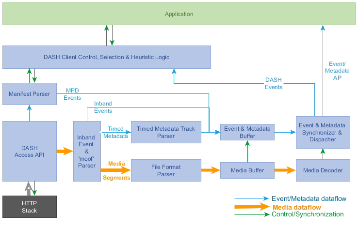
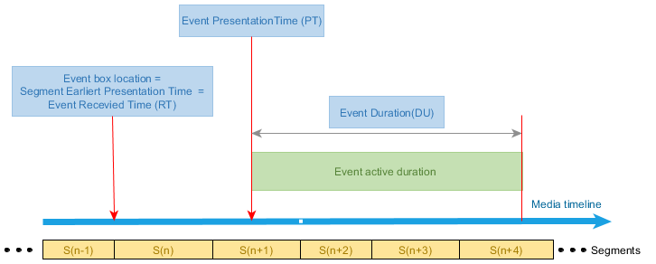
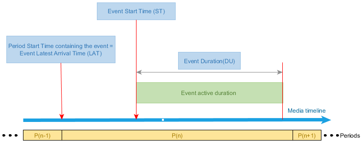
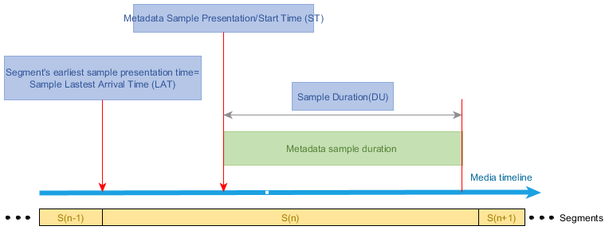
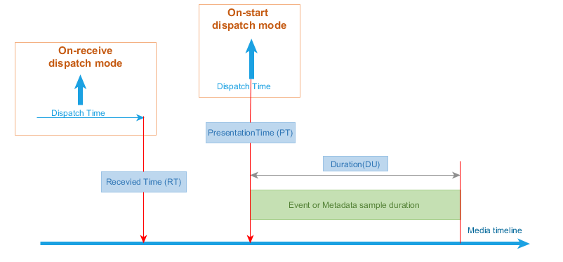
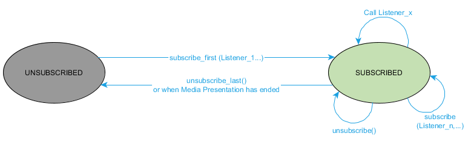

# DASH clients architecture for processing the event and timed metadata # {#event-architecture}

Figure 1 demonstrates a generic architecture of the DASH client including the event and timed metadata processing models.

<figure>
	
    <figcaption>The DASH client architecture including the inband event and Application related timed metadata handling</figcaption>
</figure>

In the above figure:

1. DASH client processes the MPD. If the manifest
    includes any MPD events, it parses them and append them to event & timed metadata buffer.

2. Based on the MPD, DASH client manages fetching and parsing the Segments before appending them into the media decoder input buffer.

3. Parsing a Segment includes:
    
    1. parse the high-level boxes such as index (sidx) &
        event message boxes, and append event message boxes to event & metadata buffer.
    2. For application related  timed metadata track, extracting data samples, and append them to event &metadata buffer.
    3. For media segment, parse the segments and append them to media buffer.

4.  The DASH events are passed to the DASH client control, while the Application events and timed metadata are passed to the event & metadata synchronization and dispatch module.

5. If App is subscribed to a specific event scheme or timed metadata stream, dispatch those instances of
    scheme or stream, according to the dispatch mode:
    1. For "on-receive" dispatch mode, dispatch the events and metadata samples as soon as they are received.
    2. For "on-start" dispatch mode, dispatch the events and metadata samples at their associated presentation time, using the synchronization signal from media decoder.

# Event and Timed metadata data timing # {#event-metadata-timing}

## Inband event timing parameters # {#Inband-event-timing}

Figure 2 presents the timing of an event in the media timeline:
<figure>
	
    <figcaption>Figure 2: The inband event timing parameter on the media timeline</figcaption>
</figure>

As shown in Figure 2, every inband event can be described with 3 timing parameters on the media timeline:

1. Event Received Time (<var>RT</var>) which is the earliest presentation time of the Segment containing the event box.

2. Event Presentation/Start Time (<var>PT</var>) which is the moment in the media timeline that event becomes active.

3. Event duration (<var>Du</var> ): the duration for which the event is active

Note that a service provider insert an inband event in the beginning of a Segment. Since each media segment has an earliest presentation time (<var>RT</var>), we can consider <var>RT</var> of the Segment carrying the event box as the location of the event box in the media timeline. Also note that the DASH client has to fetch and parse the Segment before or at its <var>RT</var> (at <var>RT</var> only assuming that the decoding and rendering of the segment takes no delay). Therefore, the event inserted in a Segment at its <var>RT</var> time should be ready to be processed and fetched no later than <var>RT</var> in the media timeline.

The second timing parameter is Event Presentation Time (<var>PT</var> ). <var>PT</var>  is the moment in the media timeline that the event becomes active. This value can be calculated using the parameters included in event message box.

The third parameter is Event Duration (<var>Du</var> ), the duration in which the event is active. <var>Du</var>  is also signaled in the event message box using a specific value.

## Event message box format and event timing parameters #{#emsg-format}

Figure 3 shows the emsg box format in DASH:
<figure>
<pre>aligned(8) class DASHEventMessageBox extends FullBox(‘emsg’, version, flags = 0){
   if (version==0) {
      string            scheme_id_uri;
      string            value;
      unsigned int(32)  timescale;
      unsigned int(32)  presentation_time_delta;
      unsigned int(32)  event_duration;
      unsigned int(32)  id;
   } else if (version==1) {
      unsigned int(32)     timescale;
      unsigned int(64)     presentation_time;
      unsigned int(32)     event_duration;
      unsigned int(32)     id;
      string               scheme_id_uri;
      string               value;
   }
   unsigned int(8)   message_data[];
}
</pre>
<figcaption>Figure 3: The emsg box format and parameters</figcaption>
</figure>

The EST of an event can be calculated using values in its emsg box:

<figure>

$$PT = \begin{cases}
RT + \frac{presentation\_time\_delta}{timescale} \space
\qquad\qquad\qquad\qquad\qquad\qquad\qquad\qquad\qquad\qquad  version=0\\ 
PeriodStart -  \frac{SegmentBase@presentationTimeOffset}{SegmentBase@timescale} + \frac{presentation\_time}{timescale}\qquad \qquad version=1
\end{cases}
$$
<figcaption>Equation 1: Event Start Time of an inband event</figcaption>
</figure>

Where <var>PeriodStart</var> is the corresponding Period‘s start time, and <{SegmentBase/presentationTimeoffset}> and <{SegmentBase/timescale}> are the [=Presentation Time Offset=] (PTO) and [=time scale=] of the corresponding Represenation.

Note that based on the above equation, <var>PT</var>  is always equal to or larger than <var>RT</var> in both versions of emsg.

Also note that since the media sample timescales might be different than emsg timescale, the <var>PT</var> might not line up with a media sample if different timescales are used.

Finally, if various Adaptation Sets carry the same events, different
Adaptation Sets/Representations with different PTOs, the
<var>presentation_time</var> values might be different per Adaptation Set/Representation, meaning that the same emsg box can not be replicated over multiple Representations and/or Adaptations Sets.

## MPD events timing model # {#mpd-event-timing}

MPD events carry the similar data model as the inband event. However they are carried in the MPD, at the Period elements. Each Period event has <{EventStream}> element(s), defining the <{EventStream/schemeIdUri}>, <{EventStream/value}> , <{EventStream/timescale}> and a sequences of <{Event}> elements. Each event may have <{Event/presentationTime}>, <{Event/duration}>, <{Event/id}> and <{Event/messageData}> attributes, as shown in Figure 4.

<figure> 
<table>
    <tbody>
    <tr class="odd">
    <td><table>
    <thead>
    <tr class="header">
    <th><strong>Element or Attribute Name</strong></th>
    <th><strong>Use</strong></th>
    <th><strong>Description</strong></th>
    <th></th>
    <th></th>
    </tr>
    </thead>
    <tbody>
    <tr class="odd">
    <td><strong>EventStream</strong></td>
    <td></td>
    <td>specifies event Stream</td>
    <td></td>
    </tr>
    <tr class="even">
    <td>@xlink:href</td>
    <td>O</td>
    <td>specifies a reference to an external <strong>EventStream</strong> element</td>
    </tr>
    <tr class="odd">
    <td>@xlink:actuate</td>
    <td>
OD

    
default: 
    onRequest
</td>
    <td>
specifies the processing instructions, which can be either "onLoad" or "onRequest".

    
This attribute shall not be present if the @xlink:href attribute is not present.
</td>
    </tr>
    <tr class="even">
    <td>@schemeIdUri</td>
    <td>M</td>
    <td>identifies the message scheme. The string may use URN or URL syntax. When a URL is used, it is recommended to also contain a month-date in the form mmyyyy; the assignment of the URL must have been authorized by the owner of the domain name in that URL on or very close to that date. A URL may resolve to an Internet location, and a location that does resolve may store a specification of the message scheme.</td>
    </tr>
    <tr class="odd">
    <td>@value</td>
    <td>O</td>
    <td>specifies the value for the event stream element. The value space and semantics must be defined by the owners of the scheme identified in the @schemeIdUri attribute.</td>
    </tr>
    <tr class="even">
    <td>@timescale</td>
    <td>O</td>
    <td>
specifies the timescale in units per seconds to be used for the derivation of different real-time duration values in the <strong>Event</strong> elements.

    
If not present on any level, it shall be set to 1.
</td>
    </tr>
    <tr class="odd">
    <td><strong>Event</strong></td>
    <td>0 ... N</td>
    <td>
specifies one event. For details see Table 5.31.

    
Events in Event Streams shall be ordered such that their presentation time is non-decreasing.
</td>
    </tr>
    </tbody>
</table>
<table>
    <tbody>
    <tr class="even">
    <td>
Legend:

    <blockquote>
    
For attributes: M=Mandatory, O=Optional, OD=Optional with Default Value, CM=Conditionally Mandatory.

    
For elements: &lt;minOccurs&gt;...&lt;maxOccurs&gt; (N=unbounded)

    </blockquote>
    
Elements are bold; attributes are non-bold and preceded with an @.
</td>
    </tr>
    </table>
    <table>
    <thead>
    <tr class="header">
    <th><strong>Element or Attribute Name</strong></th>
    <th><strong>Use</strong></th>
    <th><strong>Description</strong></th>
    </tr>
    </thead>
    <tbody>
    <tr class="odd">
    <td><strong>Event</strong></td>
    <td></td>
    <td>specifies an event and contains the message of the event, formatted as a string. The content of this element depends on the event scheme.</td>
    <td></td>
    </tr>
    <tr class="even">
    <td>@presentationTime</td>
    <td>OD 
    default: 0</td>
    <td>
specifies the presentation time of the event relative to the start of the Period.

    
The value of the presentation time in seconds is the division of the value of this attribute and the value of the @timescale attribute.

    
If not present, the value of the presentation time is 0.
</td>
    </tr>
    <tr class="odd">
    <td>@duration</td>
    <td>O</td>
    <td>
specifies the presentation duration of the event.

    
The value of the duration in seconds is the division of the value of this attribute and the value of the @timescale attribute.

    
If not present, the value of the duration is unknown.
</td>
    </tr>
    <tr class="even">
    <td>@id</td>
    <td>O</td>
    <td>
specifies an identifier for this instance of the event. Events with equivalent content and attribute values in the <strong>Event</strong> element shall have the same value for this attribute.

    
The scope of the @id for each Event is with the same @schemeIdURI and @value pair.
</td>
    </tr>
    <tr class="odd">
    <td>@messageData</td>
    <td>O</td>
    <td>
specifies the value for the event stream element. The value space and semantics must be defined by the owners of the scheme identified in the @schemeIdUri attribute.

    
NOTE: this attribute is an alternative to specifying a complete XML element(s) in the Event. It is useful when an event leans itself to a compact string representation
</td>
    </tr>
</table>
<table>
    <tbody>
    <tr class="even">
    <td>
Legend:

    <blockquote>
    
For attributes: M=Mandatory, O=Optional, OD=Optional with Default Value, CM=Conditionally Mandatory.

    
For elements: &lt;minOccurs&gt;...&lt;maxOccurs&gt; (N=unbounded)

    </blockquote>
    
Elements are bold; attributes are non-bold and preceded with an @.
</td>
    </tr>
    </tbody>
    </table></td>
    </tr>
    </tbody>
    </table>
<figcaption>Figure 4: MPD event elements</figcaption>
</figure>

As is shown in Figure 5, each MPD event has 3 associated timing
paramters in the media timeline:

1.  The Period Start Time (<var>RT</var>) containing the EventStream element.

2.  Event Start Time (<var>PT</var>): the moment in the media timeline that event
    becomes active and can be calculated from <{Event/PresentationTime}>.

3.  Event duration (<var>DU</var>): the duration for which the event is active that
    can be calculated from <{Event/duration}>.

Note that the first parameter is inherited from the [=Period=] containing
the [=Events=] and only the 2nd and 3rd parameters are
explicitly included in the <{EventStream}> element. Each <{EventStream}> also
has <{EventStream/timescale}> to scale the above parameters.

Figure 3 demonstates these parameters in the media timeline.
<figure>
  
  <figcaption>Figure 5: MPD events timing model
</figcaption></figure>

The <var>PT</var> of a MPD event relative to the <var>PeriodStart</var> time can be
calculated using values in its <{EventStream}> and <{Event}> elements:

<figure>

  $$EST = \frac{Event@presentationTime}{EventStream@timescale}$$
  <figcaption>Equation 2: Event Start Time of a MPD event
</figcaption></figure>

## Simple timed metadata timing model # {#timed-metadata-timing}

Figure 6 shows the timing model for timed metadata.
<figure>
  
  <figcaption>Figure 6: The timed metadata timing parameters on the media timeline
</figcaption></figure>

As shown in this figure, the metadata sample timing including metadata
sample presentation time (<var>PT</var>) and metadata sample duration (<var>DU</var>). Also
one or multiple metadata samples are included in a segment with Segment start time (<var>RT</var>).

Note that the metadata sample duration can not go beyond segment
duration, i.e. to the next segment. In the case of [=CMAF=], the same
constraints is maintined for CMAF Chunks.

# Event and Timed Metadata dispatch timing modes # {#event-metadata-dispatch}

Figure 7 shows two possible dispatch timing models for inband events.

<figure>
  
  <figcaption>Figure 7: The Application events and timed metadata dispatch modes
</figcaption></figure>

In this figure, two modes are shown:

1. <dfn>On-receive</dfn> Dispatch Mode: Dispatching at <var>RT</var> or earlier: Since
    the segment carrying an emsg/metadata sample has to be parsed before
    (or assuming zero decode/rendering delay as the latest at) <var>RT</var>
    on the media timeline, the event/metadata sample shall be dispatched
    at this time or before to Application. This means that Application
    has a duration of <var>PT</var>-<var>RT</var> for preparing for the event. The client doesn’t need
    to maintain states of App events or metadata samples either.
    Application has to maintain the state for any event/metadata sample,
    its <var>PT</var> and  <var>DU</var>, and monitor its activation duration, if it needs to.
    Application also needs to schedule each event/sample at its <var>PT</var>, so
    it must be time-aware to properly make use of these timing
    parameters.

2. <dfn>On-start</dfn> Dispatch Mode: Dispatching exactly at <var>PT</var>, which is the
    start/presentation time of the event/metadata sample. The DASH
    client shall calculate the <var>PT</var> for each parsed event/metadata
    sample and schedule a dispatch at this exact moment. In this case, since
    Application receives the event/sample at its start/presentation time, it needs to act on it right away. Therefore, no advanced notice is given to Application. Application however may not need to maintain
    an state for the event/sample, if the duration of the event/sample,
    and/or the sequence and order of events/samples are not important to
    Application. Depending on the nature, meaning and relationship
    between different event instances/metadata samples, an Application
    may need to maintain the state for them.

## The Dispatch Processing Model # {#dispatch-processing}

### Prerequisite

Application subscribes to specific event stream as described in [[#prose-event-API]].

The processing model varies depending on <var>dispatchMode</var>. The DASH
client dispatch module set ups [=Active Event Table=]” for each subscribed
<var>scheme\_id\_uri</var>/<var>value</var> in the case in which <var>dispatchMode</var> =
[=On\_start=]. The table would include a single list of emsg’s <var>id</var>.

#### Common process  # {#dispatch-common-process}

1. Parse the emsg/timed metadata sample and retrieve <var>scheme\_id\_uri</var>/<var>value</var>.

2. If Application is not subscribed to the <var>scheme\_id\_uri</var>/<var>value</var> pair, end the processing of this emsg.

#### [=On-recevie=] processing   # {#on-receive-proc}

Dispatch the event/timed metadata, including <var>presentation time</var>, <var>id</var>, <var>duration</var>, <var>time scale</var> and <var>data</var> as described in [[#prose-event-API]].

#### [=On-start=] processing  # {#on-start-proc}

1.  Derive the event instance’s EST/metadata sample’s MPT 

2.  If the current presentation time value is smaller than <var>PT</var>, then go to Step 5.

3.  Derive the ending time <var>ET</var>= <var>PT</var> + <var>DU</var>.

4. If  the current presentation time value is greater than <var>ET</var>, then end processing.

5. In the case of event,
    
    1.  Compare the event's <var>id</var> with the entries of [=Active Event Table=] of the same <var>scheme\_id\_uri</var>/<var>value</var>. 
          - If an entry with the identical <var>id</var> value exists, end processing.
          - If not, add emsg’s <var>id</var> to the corresponding [=Active Event Table=].

6. Dispatch the event message/metadata as described in [[#prose-event-API]]. 

## The event/metadata buffer model # {#event-metadata-buffer-model}

Along with the media samples, the event instances and metadata samples
are buffered. The event/metadata buffer should be managed with same
scheme as the media buffer, i.e. as long as a media sample exists in the
media buffer, the corresponding event and/or metadata samples should be
maintained in the event/metadata buffer.

# Prose description of APIs # {#prose-event-API}

## Event/timed metadata API # {#event-metadata-API}

The event/timed metadata API is an interface defined between a
“DASH player” as defined in DASH-IF, or a “DASH client” as defined in
3GPP TS 26.247 or ISO/IEC 23009-1 and a device application in the
exchange of subscription data and dispatch/transfer of matching DASH
Event or timed metadata information between these entities. The
Event/timed metadata API is shown at Figure 1.

The description of the API below is strictly functional, i.e. implementation-agnostic, is intended to be employed for the specification of the API in Javascript for the dash.js open source DASH
player, and in IDL such as the OMG IDL or WebIDL. For example, the subscribeEvent() method as defined below may be mapped to the existing **on(type,listener,scope)** method as defined for the dash.js under **MediaPlayerEvents**.

The state diagram of the DASH client/player associated with the API is
shown below in Figure 8:
<figure>
  
  <figcaption>Figure 8 – State Diagram of the DASH client/player for the event/timed
metadata API.
</figcaption></figure>

Note that the scope of the above state diagram is the entire set of
applicable events/timed metadata streams being subscribed/unsubscribed,
i.e. it is not indicating the state model of the DASH client/player in
the context of a single Event/timed metadata stream
subscription/un-subscription. The application subscribes to the
reception of the desired event/timed metadata and associated information
by the **subscribeEvent()** method. The parameters to be passed in this
method are:

  - <var>appId</var> – (Optional) A unique ID for the Application subscribing to
    data dispatch from the DASH client/player. Depending on the
    platform/implementation this identifier may be used by the DASH
    client/player to maintain state information.

  - <var>schemeIdUri</var> – A unique identifier scheme for the associated DASH
    Event/metadata stream of interest to the Application. This string
    may use a URN or a URL syntax, and may correspond to either an MPD
    Event, an inband Event, or a timed metadata stream identifer. The
    schemeIdUri may be formatted as a regular expression (regex).

  - <var>value</var> – A value of the event or timed metadata stream within the
    scope of the above schemeIdUri, optional to include. When not
    present, no default value is defined – i.e., no filtering criterion
    is associated with the Event scheme identification.

  - <var>dispatchMode</var> – Indicates when the event handler function identified
    in the callbackFunction argument should be called:
    
      - <var>dispatchMode</var> = <var>On\_receive</var> – provide the event/timed metadata
        sample data to the App as soon as it is detected by DASH
        client/player;
    
      - <var>dispatchMode</var> = <var>On\_start</var> – provide the event/timed metadata
        sample data to the App at the start time of Event message or at
        the presentation time of timed metadata sample.

  - <var>callbackFunction</var> – the name of the function to be (asynchronously)
    called for an event corresponding to the specified
    schemeIdUri/value. The callback function is invoked with the
    eventType, eventData and timeOfDispatch arguments described below.

Upon successful execution of the event/timed metadata subscription call
(for which the DASH client/player will return a corresponding
acknowledgment), the DASH client/player shall monitor the source of
potential Event stream information, i.e., the MPD or incoming DASH
Segments, for matching values of the subscribed <var>schemeIdUri</var>/(<var>value</var>). The
parentheses around value is because this parameter may be absent in the
event/timed metadata subscription call. When a matching event/metadata
sample is detected, the DASH client/player invokes the function
specified in the callbackFunction argument with the following
parameters. It should additionally provide to the Application the
current presentation time at the DASH client/player when performing the
dispatch action. The parameters to be passed in this method are:

  - <var>type</var> – the type of event message/timed metadata sample whose
    scheme identifier matches the subscribed value by the Application.
    Value of ‘mpd’ denotes an MPD Event, value of ‘inband’ denotes an
    inband Event, and value ‘meta’ denotes a timed metadata sample.

  - <var>data</var> – Container for the parameter values contained in the
    Event message or the timed metadata sample data.
    
      - In the case of an MPD Event, the eventData shall contain the
        values the following attributes of the <{EventStream}> and
        <{Event}> elements :

<table>
<thead>
<tr class="header">
<th></th>
<th></th>
<th>‘immediate’</th>
<th>‘at_start’</th>
</tr>
</thead>
<tbody>
<tr class="odd">
<td><strong>eventData attribute</strong></td>
<td><strong>Source/Parent element</strong></td>
<td></td>
<td></td>
</tr>
<tr class="even">
<td>@schemeIdUri</td>
<td><strong>MPD.Period.EventStream</strong></td>
<td><strong>O</strong></td>
<td><strong>O</strong></td>
</tr>
<tr class="odd">
<td>@value</td>
<td><strong>MPD.Period.EventStream</strong></td>
<td><strong>O</strong></td>
<td><strong>O</strong></td>
</tr>
<tr class="even">
<td>@timescale</td>
<td><strong>MPD.Period.EventStream</strong></td>
<td><strong>Y</strong></td>
<td><strong>N</strong></td>
</tr>
<tr class="odd">
<td>@presentationTime</td>
<td><strong>MPD.Period.EventStream.Event</strong></td>
<td><strong>Y</strong></td>
<td><strong>N</strong></td>
</tr>
<tr class="even">
<td>@duration</td>
<td><strong>MPD.Period.EventStream.Event</strong></td>
<td><strong>Y</strong></td>
<td><strong>N</strong></td>
</tr>
<tr class="odd">
<td>@id</td>
<td><strong>MPD.Period.EventStream.Event</strong></td>
<td><strong>Y</strong></td>
<td><strong>N</strong></td>
</tr>
<tr class="even">
<td>@messageData</td>
<td><strong>MPD.Period.EventStream.Event</strong></td>
<td><strong>Y</strong></td>
<td><strong>Y</strong></td>
</tr>
<tr class="odd">
<td>otherEventAttributes</td>
<td>XML notation of attributes matching xs:anyAttribute of <strong>Event</strong></td>
<td>Y</td>
<td>Y</td>
</tr>
<tr class="even">
<td>otherEventElements</td>
<td>XML notation of elements matching xs:any of <strong>Event</strong></td>
<td>Y</td>
<td>Y</td>
</tr>
</tbody>
</table>

> Y= Yes, N= NO, O= Optional

  - In the case of an inband Event, for either a version 0 or 1 ‘emsg’,
    the eventData shall contain the values of the following parameters
    in the emsg box:

<table>
<thead>
<tr class="header">
<th></th>
<th>‘immediate’</th>
<th>‘at_start’</th>
</tr>
</thead>
<tbody>
<tr class="odd">
<td>scheme_id_uri</td>
<td>O</td>
<td>O</td>
</tr>
<tr class="even">
<td>value</td>
<td>O</td>
<td>O</td>
</tr>
<tr class="odd">
<td>timescale</td>
<td>Y</td>
<td>N</td>
</tr>
<tr class="even">
<td>presentation_time_delta</td>
<td>Y</td>
<td>N</td>
</tr>
<tr class="odd">
<td>event_duration</td>
<td>Y</td>
<td>N</td>
</tr>
<tr class="even">
<td>id</td>
<td>Y</td>
<td>N</td>
</tr>
<tr class="odd">
<td>message_data()</td>
<td>Y</td>
<td>Y</td>
</tr>
</tbody>
</table>

> Y= Yes, N= NO, O= Optional

  - In the case of a timed metadata sample, the eventData shall contain
    the values of the following parameters of the timed metadata sample:

<table>
<thead>
<tr class="header">
<th></th>
<th>‘immediate’</th>
<th>‘at_start’</th>
</tr>
</thead>
<tbody>
<tr class="odd">
<td>scheme_id_uri</td>
<td>O</td>
<td>O</td>
</tr>
<tr class="even">
<td>timescale</td>
<td>Y</td>
<td>N</td>
</tr>
<tr class="odd">
<td>presentation_time offset</td>
<td>Y</td>
<td>N</td>
</tr>
<tr class="even">
<td>Sample duration</td>
<td>Y</td>
<td>N</td>
</tr>
<tr class="odd">
<td>Sample mdat data</td>
<td>Y</td>
<td>Y</td>
</tr>
</tbody>
</table>

> Y= Yes, N= NO, O= Optional

  - <var>timeOfDispatch</var> – (Optional) the Media Presentation time on the
    fragmented movie timeline, in units of time scale represented by the
    timescale parameter, at which the DASH client dispatches the Event
    data to the App. This parameter shall be optional to include in the
    callback if dispatchMode was set to ‘at\_start’ in the associated
    **subscribeEvent()** call.

Note that from the above, in the case of a version 1 ‘emsg’, the DASH
client is expected to process the ‘emsg’ box in translating
‘presentation\_time’ to presentation\_time\_delta’, indicating the
event start/timed metadata sample presentation time offset from the time
of dispatch to the App.

In order to remove a listener the **unsubscribeEvent()** function is
called with the following arguments:

  - <var>appId</var> (Optional)

  - <var>schemeIdUri</var> - A unique identifier scheme for the associated DASH
    Event stream of interest to the Application.

  - <var>value</var>

  - <var>callbackFunction</var>

If a specific listener is given in the callbackFunction argument, then
only that listener is removed for the specified schemeIdUri/value.
Omitting or passing null to the callbackFunction argument would remove
all event listeners for the specified schemeIdUri/value.
