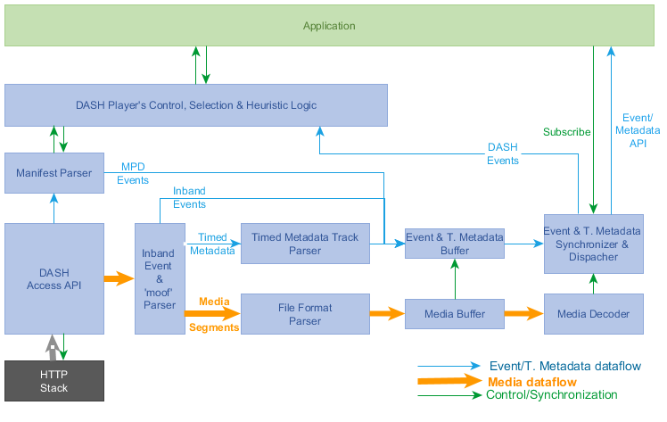

<!-- Document metadata follows. The below sections are used by the document compiler and are not directly visible. -->

<pre class="metadata">
Revision: 1.0

Title: DASH player's Application Events and Timed Metadata Processing Models and APIs
Status: LD
Shortname: application events
URL: https://dashif.org/guidelines/name-of-doc
Issue Tracking: GitHub https://github.com/Dash-Industry-Forum/Events/issues
Repository: https://github.com/Dash-Industry-Forum/Event GitHub
Editor: DASH Industry Forum

Default Highlight: text
<!-- Enabling line numbers breaks code blocks in PDF! (2018-10-02) -->
Line Numbers: off
Markup Shorthands: markdown yes
Boilerplate: copyright off, abstract off
Abstract: None
</pre>

# DASH player architecture for processing the event and timed metadata # {#event-architecture}

Figure 1 demonstrates a generic architecture of the DASH player including the event and timed metadata processing models.

<figure>
	
    <figcaption>The DASH player architecture including the inband event and Application related timed metadata handling</figcaption>
</figure>

In the above figure:

1. DASH player processes the MPD. If the manifest
    includes any MPD events, it parses them and append them to event & timed metadata buffer.

2. Based on the MPD, DASH player manages fetching and parsing the Segments before appending them into the media decoder input buffer.

3. Parsing a Segment includes:
    
    1. parse the high-level boxes such as index (sidx) &
        event message boxes, and append event message boxes to event & metadata buffer.
    2. For application related  timed metadata track, extracting data samples, and append them to event &metadata buffer.
    3. For media segment, parse the segments and append them to media buffer.

4.  The DASH events are passed to the DASH player control, while the Application events and timed metadata are passed to the event & metadata synchronization and dispatch module.

5. If App is subscribed to a specific event scheme or timed metadata stream, dispatch those instances of
    scheme or stream, according to the dispatch mode:
    1. For [=On-receive=] dispatch mode, dispatch the events and metadata samples as soon as they are received.
    2. For [=On-start=] dispatch mode, dispatch the events and metadata samples at their associated presentation time, using the synchronization signal from media decoder.

# Event and Timed metadata data timing # {#event-metadata-timing}

## Inband event timing parameters ## {#Inband-event-timing}

Figure 2 presents the timing of an event in the media timeline:
<figure>
	
    <figcaption>The inband event timing parameter on the media timeline</figcaption>
</figure>

As shown in Figure 2, every inband event can be described with 3 timing parameters on the media timeline:

1. Event Received Time (<var>RT</var>) which is the earliest presentation time of the Segment containing the event box.

2. Event Presentation/Start Time (<var>PT</var>) which is the moment in the media timeline that event becomes active.

3. Event duration (<var>DU</var>): the duration for which the event is active

An inband event is inserted in the beginning of a Segment. Since each media segment has an earliest presentation time (<var>RT</var>), <var>RT</var> of the Segment carrying the event box can be considered as the location of the event box in the media timeline. DASH player has to fetch and parse the Segment before or at its <var>RT</var> (at <var>RT</var> only if the decoding and rendering of the segment takes no delay). Therefore, the event inserted in a Segment at its <var>RT</var> time will be ready to be processed and fetched no later than <var>RT</var> in the media timeline.

The second timing parameter is Event Presentation Time (<var>PT</var> ). <var>PT</var>  is the moment in the media timeline that the event becomes active. This value can be calculated using the parameters included in event message box.

The third parameter is Event Duration (<var>DU</var> ), the duration in which the event is active. <var>DU</var>  is also signaled in the event message box using a specific value.

## Event message box format and event timing parameters ## {#emsg-format}

Figure 3 shows the emsg box format in DASH:

<figure>
  <pre>
  aligned(8) class DASHEventMessageBox extends FullBox(‘emsg’, version, flags = 0){
   if (version==0) {
      string               scheme_id_uri;
      string               value;
      unsigned int(32)     timescale;
      unsigned int(32)     presentation_time_delta;
      unsigned int(32)     event_duration;
      unsigned int(32)     id;
   } else if (version==1) {
      unsigned int(32)     timescale;
      unsigned int(64)     presentation_time;
      unsigned int(32)     event_duration;
      unsigned int(32)     id;
      string               scheme_id_uri;
      string               value;
   }
   unsigned int(8)   message_data[];
}
  </pre>
  <figcaption>The emsg box format and parameters</figcaption>
</figure>

The <var>PT</var> of an event can be calculated using values in its emsg box:

<figure>

$$PT = \begin{cases}
RT + \frac{presentation\_time\_delta}{timescale} \space
\qquad\qquad\qquad\qquad\qquad\qquad\qquad\qquad\qquad\qquad  version=0\\ 
PeriodStart -  \frac{SegmentBase@presentationTimeOffset}{SegmentBase@timescale} + \frac{presentation\_time}{timescale}\qquad \qquad version=1
\end{cases}
$$
<figcaption>Event Start Time of an inband event</figcaption>
</figure>

Where <var>PeriodStart</var> is the corresponding Period‘s start time, and <{SegmentBase/presentationTimeoffset}> and <{SegmentBase/timescale}> are the [=Presentation Time Offset=] (PTO) and [=time scale=] of the corresponding Represenation.

Note: <var>PT</var> is always equal to or larger than <var>RT</var> in both versions of emsg.

Note: Since the media sample timescales might be different than emsg's timescale, <var>PT</var> might not line up with a media sample if different timescales are used.

Note: If various Adaptation Sets carry the same events, different
Adaptation Sets/Representations with different PTOs, the
<var>presentation_time_delta</var> and/or <var>presentation_time</var> values might be different per Adaptation Set/Representation, i.e. the same emsg box can not be replicated over multiple Representations and/or Adaptations Sets.

In this document, we use the following common variable names instead of some of above variables to harmonize parameters between Inband events, MPD events, and timed metadata samples:

- <var>scheme_id</var> = scheme_id_uri
- <var>duration</var> = event_duration

## MPD events timing model ## {#mpd-event-timing}

MPD events carry the similar data model as the inband event. However they are carried in the MPD, at the Period elements. Each Period event has <{EventStream}> element(s), defining the <{EventStream/schemeIdUri}>, <{EventStream/value}> , <{EventStream/timescale}> and a sequences of <{Event}> elements. Each event may have <{Event/presentationTime}>, <{Event/duration}>, <{Event/id}> and <{Event/messageData}> attributes, as shown in Figure 4.

<figure><table class=MsoTableGrid border=1 cellspacing=0 cellpadding=0
 style='border-collapse:collapse;border:none'>
 <tr>
  <td width=623 valign=top style='width:467.25pt;border:solid #4472C4 2.25pt;
  padding:0in 5.4pt 0in 5.4pt'>
  
&nbsp;

  <table class=MsoNormalTable border=1 cellspacing=0 cellpadding=0 width="99%"
   style='width:99.2%;border-collapse:collapse;border:none'>
   <tr>
    <td width="29%" colspan=3 valign=top style='width:29.84%;border:solid black 1.0pt;
    padding:0in 5.4pt 0in 5.4pt'>
    
<b>Element
    or Attribute Name</b>

    </td>
    <td width="13%" valign=top style='width:13.84%;border:solid black 1.0pt;
    border-left:none;padding:0in 5.4pt 0in 5.4pt'>
    
<b>Use</b>

    </td>
    <td width="56%" valign=top style='width:56.32%;border:solid black 1.0pt;
    border-left:none;padding:0in 5.4pt 0in 5.4pt'>
    
<b>Description</b>

    </td>
   </tr>
   <tr>
    <td width="2%" valign=top style='width:2.52%;border-top:none;border-left:
    solid black 1.0pt;border-bottom:solid black 1.0pt;border-right:none;
    padding:0in 5.4pt 0in 5.4pt'>
    
<b>&nbsp;</b>

    </td>
    <td width="27%" colspan=2 valign=top style='width:27.32%;border-top:none;
    border-left:none;border-bottom:solid black 1.0pt;border-right:solid black 1.0pt;
    padding:0in 5.4pt 0in 5.4pt'>
    
<b>EventStream</b>

    </td>
    <td width="13%" valign=top style='width:13.84%;border-top:none;border-left:
    none;border-bottom:solid black 1.0pt;border-right:solid black 1.0pt;
    padding:0in 5.4pt 0in 5.4pt'>
    
<b>&nbsp;</b>

    </td>
    <td width="56%" valign=top style='width:56.32%;border-top:none;border-left:
    none;border-bottom:solid black 1.0pt;border-right:solid black 1.0pt;
    padding:0in 5.4pt 0in 5.4pt'>
    
specifies event
    Stream

    </td>
   </tr>
   <tr>
    <td width="2%" valign=top style='width:2.52%;border-top:none;border-left:
    solid black 1.0pt;border-bottom:solid black 1.0pt;border-right:none;
    padding:0in 5.4pt 0in 5.4pt'>
    
<b>&nbsp;</b>

    </td>
    <td width="2%" valign=top style='width:2.64%;border:none;border-bottom:
    solid black 1.0pt;padding:0in 5.4pt 0in 5.4pt'>
    
<b>&nbsp;</b>

    </td>
    <td width="24%" valign=top style='width:24.68%;border-top:none;border-left:
    none;border-bottom:solid black 1.0pt;border-right:solid black 1.0pt;
    padding:0in 5.4pt 0in 5.4pt'>
    
@xlink:href

    </td>
    <td width="13%" valign=top style='width:13.84%;border-top:none;border-left:
    none;border-bottom:solid black 1.0pt;border-right:solid black 1.0pt;
    padding:0in 5.4pt 0in 5.4pt'>
    
O

    </td>
    <td width="56%" valign=top style='width:56.32%;border-top:none;border-left:
    none;border-bottom:solid black 1.0pt;border-right:solid black 1.0pt;
    padding:0in 5.4pt 0in 5.4pt'>
    
specifies a reference to an external <b>EventStream</b> element

    </td>
   </tr>
   <tr>
    <td width="2%" valign=top style='width:2.52%;border-top:none;border-left:
    solid black 1.0pt;border-bottom:solid black 1.0pt;border-right:none;
    padding:0in 5.4pt 0in 5.4pt'>
    
&nbsp;

    </td>
    <td width="2%" valign=top style='width:2.64%;border:none;border-bottom:
    solid black 1.0pt;padding:0in 5.4pt 0in 5.4pt'>
    
&nbsp;

    </td>
    <td width="24%" valign=top style='width:24.68%;border-top:none;border-left:
    none;border-bottom:solid black 1.0pt;border-right:solid black 1.0pt;
    padding:0in 5.4pt 0in 5.4pt'>
    
@xlink:actuate

    </td>
    <td width="13%" valign=top style='width:13.84%;border-top:none;border-left:
    none;border-bottom:solid black 1.0pt;border-right:solid black 1.0pt;
    padding:0in 5.4pt 0in 5.4pt'>
    
OD

    
default: 
    onRequest

    </td>
    <td width="56%" valign=top style='width:56.32%;border-top:none;border-left:
    none;border-bottom:solid black 1.0pt;border-right:solid black 1.0pt;
    padding:0in 5.4pt 0in 5.4pt'>
    
specifies the
    processing instructions, which can be either &quot;onLoad&quot; or &quot;onRequest&quot;.

    
This attribute shall
    not be present if the @xlink:href attribute is not present.

    </td>
   </tr>
   <tr>
    <td width="2%" valign=top style='width:2.52%;border-top:none;border-left:
    solid black 1.0pt;border-bottom:solid black 1.0pt;border-right:none;
    padding:0in 5.4pt 0in 5.4pt'>
    
&nbsp;

    </td>
    <td width="2%" valign=top style='width:2.64%;border:none;border-bottom:
    solid black 1.0pt;padding:0in 5.4pt 0in 5.4pt'>
    
&nbsp;

    </td>
    <td width="24%" valign=top style='width:24.68%;border-top:none;border-left:
    none;border-bottom:solid black 1.0pt;border-right:solid black 1.0pt;
    padding:0in 5.4pt 0in 5.4pt'>
    
@schemeIdUri

    </td>
    <td width="13%" valign=top style='width:13.84%;border-top:none;border-left:
    none;border-bottom:solid black 1.0pt;border-right:solid black 1.0pt;
    padding:0in 5.4pt 0in 5.4pt'>
    
M

    </td>
    <td width="56%" valign=top style='width:56.32%;border-top:none;border-left:
    none;border-bottom:solid black 1.0pt;border-right:solid black 1.0pt;
    padding:0in 5.4pt 0in 5.4pt'>
    
identifies the
    message scheme. The string may use URN or URL syntax.&nbsp; When a URL is
    used, it is recommended to also contain a month-date in the form mmyyyy;
    the assignment of the URL must have been authorized by the owner of the
    domain name in that URL on or very close to that date.&nbsp; A URL may
    resolve to an Internet location, and a location that does resolve may store
    a specification of the message scheme.

    </td>
   </tr>
   <tr>
    <td width="2%" valign=top style='width:2.52%;border-top:none;border-left:
    solid black 1.0pt;border-bottom:solid black 1.0pt;border-right:none;
    padding:0in 5.4pt 0in 5.4pt'>
    
&nbsp;

    </td>
    <td width="2%" valign=top style='width:2.64%;border:none;border-bottom:
    solid black 1.0pt;padding:0in 5.4pt 0in 5.4pt'>
    
<b>&nbsp;</b>

    </td>
    <td width="24%" valign=top style='width:24.68%;border-top:none;border-left:
    none;border-bottom:solid black 1.0pt;border-right:solid black 1.0pt;
    padding:0in 5.4pt 0in 5.4pt'>
    
@value

    </td>
    <td width="13%" valign=top style='width:13.84%;border-top:none;border-left:
    none;border-bottom:solid black 1.0pt;border-right:solid black 1.0pt;
    padding:0in 5.4pt 0in 5.4pt'>
    
O

    </td>
    <td width="56%" valign=top style='width:56.32%;border-top:none;border-left:
    none;border-bottom:solid black 1.0pt;border-right:solid black 1.0pt;
    padding:0in 5.4pt 0in 5.4pt'>
    
specifies the value
    for the event stream element. The value space and semantics must be defined
    by the owners of the scheme identified in the @schemeIdUri attribute.

    </td>
   </tr>
   <tr>
    <td width="2%" valign=top style='width:2.52%;border-top:none;border-left:
    solid black 1.0pt;border-bottom:solid black 1.0pt;border-right:none;
    padding:0in 5.4pt 0in 5.4pt'>
    
&nbsp;

    </td>
    <td width="2%" valign=top style='width:2.64%;border:none;border-bottom:
    solid black 1.0pt;padding:0in 5.4pt 0in 5.4pt'>
    
&nbsp;

    </td>
    <td width="24%" valign=top style='width:24.68%;border-top:none;border-left:
    none;border-bottom:solid black 1.0pt;border-right:solid black 1.0pt;
    padding:0in 5.4pt 0in 5.4pt'>
    
@timescale

    </td>
    <td width="13%" valign=top style='width:13.84%;border-top:none;border-left:
    none;border-bottom:solid black 1.0pt;border-right:solid black 1.0pt;
    padding:0in 5.4pt 0in 5.4pt'>
    
O

    </td>
    <td width="56%" valign=top style='width:56.32%;border-top:none;border-left:
    none;border-bottom:solid black 1.0pt;border-right:solid black 1.0pt;
    padding:0in 5.4pt 0in 5.4pt'>
    
specifies the timescale in units per seconds to be
    used for the derivation of different real-time duration values in the <b>Event</b> elements.

    
If not present on any level, it shall be set to 1.

    </td>
   </tr>
   <tr>
    <td width="2%" valign=top style='width:2.52%;border-top:none;border-left:
    solid black 1.0pt;border-bottom:solid black 1.0pt;border-right:none;
    padding:0in 5.4pt 0in 5.4pt'>
    
&nbsp;

    </td>
    <td width="2%" valign=top style='width:2.64%;border:none;border-bottom:
    solid black 1.0pt;padding:0in 5.4pt 0in 5.4pt'>
    
&nbsp;

    </td>
    <td width="24%" valign=top style='width:24.68%;border-top:none;border-left:
    none;border-bottom:solid black 1.0pt;border-right:solid black 1.0pt;
    padding:0in 5.4pt 0in 5.4pt'>
    
<b>Event</b>

    </td>
    <td width="13%" valign=top style='width:13.84%;border-top:none;border-left:
    none;border-bottom:solid black 1.0pt;border-right:solid black 1.0pt;
    padding:0in 5.4pt 0in 5.4pt'>
    
0 ... N

    </td>
    <td width="56%" valign=top style='width:56.32%;border-top:none;border-left:
    none;border-bottom:solid black 1.0pt;border-right:solid black 1.0pt;
    padding:0in 5.4pt 0in 5.4pt'>
    
specifies one event.
    For details see Table 5.31. 

    
Events in Event
    Streams shall be ordered such that their presentation time is
    non-decreasing.

    </td>
   </tr>
   <tr>
    <td width="100%" colspan=5 valign=top style='width:100.0%;border:solid black 1.0pt;
    border-top:none;padding:0in 5.4pt 0in 5.4pt'>
    
Legend:

    
For attributes: M=Mandatory,
    O=Optional, OD=Optional with Default Value, CM=Conditionally Mandatory.

    
For elements:
    &lt;minOccurs&gt;...&lt;maxOccurs&gt; (N=unbounded)

    
Elements are bold; attributes are non-bold and preceded with an @.

    </td>
   </tr>
  </table>
  
&nbsp;

  
&nbsp;

  <table class=MsoNormalTable border=1 cellspacing=0 cellpadding=0 width="99%"
   style='width:99.2%;border-collapse:collapse;border:none'>
   <tr>
    <td width="34%" colspan=5 valign=top style='width:34.44%;border:solid black 1.0pt;
    padding:0in 5.4pt 0in 5.4pt'>
    
<b>Element or Attribute Name</b>

    </td>
    <td width="14%" valign=top style='width:14.16%;border:solid black 1.0pt;
    border-left:none;padding:0in 5.4pt 0in 5.4pt'>
    
<b>Use</b>

    </td>
    <td width="51%" valign=top style='width:51.4%;border:solid black 1.0pt;
    border-left:none;padding:0in 5.4pt 0in 5.4pt'>
    
<b>Description</b>

    </td>
   </tr>
   <tr>
    <td width="2%" valign=top style='width:2.54%;border-top:none;border-left:
    solid black 1.0pt;border-bottom:solid black 1.0pt;border-right:none;
    padding:0in 5.4pt 0in 5.4pt'>
    
&nbsp;

    </td>
    <td width="2%" valign=top style='width:2.54%;border:none;border-bottom:
    solid black 1.0pt;padding:0in 5.4pt 0in 5.4pt'>
    
&nbsp;

    </td>
    <td width="2%" valign=top style='width:2.54%;border:none;border-bottom:
    solid black 1.0pt;padding:0in 5.4pt 0in 5.4pt'>
    
&nbsp;

    </td>
    <td width="26%" colspan=2 valign=top style='width:26.8%;border-top:none;
    border-left:none;border-bottom:solid black 1.0pt;border-right:solid black 1.0pt;
    padding:0in 5.4pt 0in 5.4pt'>
    
<b>Event</b>

    </td>
    <td width="14%" valign=top style='width:14.16%;border-top:none;border-left:
    none;border-bottom:solid black 1.0pt;border-right:solid black 1.0pt;
    padding:0in 5.4pt 0in 5.4pt'>
    
<b>&nbsp;</b>

    </td>
    <td width="51%" valign=top style='width:51.4%;border-top:none;border-left:
    none;border-bottom:solid black 1.0pt;border-right:solid black 1.0pt;
    padding:0in 5.4pt 0in 5.4pt'>
    
specifies an event
    and contains the message of the event,
    formatted as a string. The content of this element depends on the event
    scheme. 

    </td>
   </tr>
   <tr>
    <td width="2%" valign=top style='width:2.54%;border-top:none;border-left:
    solid black 1.0pt;border-bottom:solid black 1.0pt;border-right:none;
    padding:0in 5.4pt 0in 5.4pt'>
    
&nbsp;

    </td>
    <td width="2%" valign=top style='width:2.54%;border:none;border-bottom:
    solid black 1.0pt;padding:0in 5.4pt 0in 5.4pt'>
    
&nbsp;

    </td>
    <td width="2%" valign=top style='width:2.54%;border:none;border-bottom:
    solid black 1.0pt;padding:0in 5.4pt 0in 5.4pt'>
    
&nbsp;

    </td>
    <td width="2%" valign=top style='width:2.62%;border:none;border-bottom:
    solid black 1.0pt;padding:0in 5.4pt 0in 5.4pt'>
    
&nbsp;

    </td>
    <td width="24%" valign=top style='width:24.18%;border-top:none;border-left:
    none;border-bottom:solid black 1.0pt;border-right:solid black 1.0pt;
    padding:0in 5.4pt 0in 5.4pt'>
    
@presentationTime

    </td>
    <td width="14%" valign=top style='width:14.16%;border-top:none;border-left:
    none;border-bottom:solid black 1.0pt;border-right:solid black 1.0pt;
    padding:0in 5.4pt 0in 5.4pt'>
    
OD 
    default: 0

    </td>
    <td width="51%" valign=top style='width:51.4%;border-top:none;border-left:
    none;border-bottom:solid black 1.0pt;border-right:solid black 1.0pt;
    padding:0in 5.4pt 0in 5.4pt'>
    
specifies the
    presentation time of the event relative to the start of the Period.

    
The value of the
    presentation time in seconds is the division of the value of this attribute
    and the value of the @timescale attribute.

    
If not present, the
    value of the presentation time is 0.

    </td>
   </tr>
   <tr>
    <td width="2%" valign=top style='width:2.54%;border-top:none;border-left:
    solid black 1.0pt;border-bottom:solid black 1.0pt;border-right:none;
    padding:0in 5.4pt 0in 5.4pt'>
    
&nbsp;

    </td>
    <td width="2%" valign=top style='width:2.54%;border:none;border-bottom:
    solid black 1.0pt;padding:0in 5.4pt 0in 5.4pt'>
    
&nbsp;

    </td>
    <td width="2%" valign=top style='width:2.54%;border:none;border-bottom:
    solid black 1.0pt;padding:0in 5.4pt 0in 5.4pt'>
    
&nbsp;

    </td>
    <td width="2%" valign=top style='width:2.62%;border:none;border-bottom:
    solid black 1.0pt;padding:0in 5.4pt 0in 5.4pt'>
    
&nbsp;

    </td>
    <td width="24%" valign=top style='width:24.18%;border-top:none;border-left:
    none;border-bottom:solid black 1.0pt;border-right:solid black 1.0pt;
    padding:0in 5.4pt 0in 5.4pt'>
    
@duration

    </td>
    <td width="14%" valign=top style='width:14.16%;border-top:none;border-left:
    none;border-bottom:solid black 1.0pt;border-right:solid black 1.0pt;
    padding:0in 5.4pt 0in 5.4pt'>
    
O

    </td>
    <td width="51%" valign=top style='width:51.4%;border-top:none;border-left:
    none;border-bottom:solid black 1.0pt;border-right:solid black 1.0pt;
    padding:0in 5.4pt 0in 5.4pt'>
    
specifies the presentation duration of the event.

    
The value of the
    duration in seconds is the division of the value of this attribute and the
    value of the @timescale attribute.

    
If not present, the
    value of the duration is unknown.

    </td>
   </tr>
   <tr>
    <td width="2%" valign=top style='width:2.54%;border-top:none;border-left:
    solid black 1.0pt;border-bottom:solid black 1.0pt;border-right:none;
    padding:0in 5.4pt 0in 5.4pt'>
    
&nbsp;

    </td>
    <td width="2%" valign=top style='width:2.54%;border:none;border-bottom:
    solid black 1.0pt;padding:0in 5.4pt 0in 5.4pt'>
    
&nbsp;

    </td>
    <td width="2%" valign=top style='width:2.54%;border:none;border-bottom:
    solid black 1.0pt;padding:0in 5.4pt 0in 5.4pt'>
    
&nbsp;

    </td>
    <td width="2%" valign=top style='width:2.62%;border:none;border-bottom:
    solid black 1.0pt;padding:0in 5.4pt 0in 5.4pt'>
    
&nbsp;

    </td>
    <td width="24%" valign=top style='width:24.18%;border-top:none;border-left:
    none;border-bottom:solid black 1.0pt;border-right:solid black 1.0pt;
    padding:0in 5.4pt 0in 5.4pt'>
    
@id

    </td>
    <td width="14%" valign=top style='width:14.16%;border-top:none;border-left:
    none;border-bottom:solid black 1.0pt;border-right:solid black 1.0pt;
    padding:0in 5.4pt 0in 5.4pt'>
    
O

    </td>
    <td width="51%" valign=top style='width:51.4%;border-top:none;border-left:
    none;border-bottom:solid black 1.0pt;border-right:solid black 1.0pt;
    padding:0in 5.4pt 0in 5.4pt'>
    
specifies an
    identifier for this instance of the event.&nbsp; Events with equivalent
    content and attribute values in the <b>Event</b>
    element shall have the same value for this attribute. 

    
The scope of the @id for each Event is with the same @schemeIdURI and @value
    pair.

    </td>
   </tr>
   <tr>
    <td width="2%" valign=top style='width:2.54%;border-top:none;border-left:
    solid black 1.0pt;border-bottom:solid black 1.0pt;border-right:none;
    padding:0in 5.4pt 0in 5.4pt'>
    
&nbsp;

    </td>
    <td width="2%" valign=top style='width:2.54%;border:none;border-bottom:
    solid black 1.0pt;padding:0in 5.4pt 0in 5.4pt'>
    
&nbsp;

    </td>
    <td width="2%" valign=top style='width:2.54%;border:none;border-bottom:
    solid black 1.0pt;padding:0in 5.4pt 0in 5.4pt'>
    
&nbsp;

    </td>
    <td width="2%" valign=top style='width:2.62%;border:none;border-bottom:
    solid black 1.0pt;padding:0in 5.4pt 0in 5.4pt'>
    
&nbsp;

    </td>
    <td width="24%" valign=top style='width:24.18%;border-top:none;border-left:
    none;border-bottom:solid black 1.0pt;border-right:solid black 1.0pt;
    padding:0in 5.4pt 0in 5.4pt'>
    
@messageData

    </td>
    <td width="14%" valign=top style='width:14.16%;border-top:none;border-left:
    none;border-bottom:solid black 1.0pt;border-right:solid black 1.0pt;
    padding:0in 5.4pt 0in 5.4pt'>
    
O

    </td>
    <td width="51%" valign=top style='width:51.4%;border-top:none;border-left:
    none;border-bottom:solid black 1.0pt;border-right:solid black 1.0pt;
    padding:0in 5.4pt 0in 5.4pt'>
    
specifies the value
    for the event stream element. The value space and semantics must be defined
    by the owners of the scheme identified in the @schemeIdUri attribute.

    
NOTE: this attribute
    is an alternative to specifying a complete XML element(s) in the Event. It
    is useful when an event leans itself to a compact string representation

    </td>
   </tr>
   <tr>
    <td width="100%" colspan=7 valign=top style='width:100.0%;border:solid black 1.0pt;
    border-top:none;padding:0in 5.4pt 0in 5.4pt'>
    
Legend:

    
For attributes: M=Mandatory,
    O=Optional, OD=Optional with Default Value, CM=Conditionally Mandatory.

    
For elements:
    &lt;minOccurs&gt;...&lt;maxOccurs&gt; (N=unbounded)

    
Elements are bold; attributes are non-bold and preceded with an @.

    </td>
   </tr>
  </table>
  

  </td>
 </tr>
</table>
  <figcaption>MPD event elements</figcaption>
</figure>

As is shown in Figure 5, each MPD event has 3 associated timing
paramters in the media timeline:

1.  The Period Start Time (<var>RT</var>) containing the EventStream element.

2.  Event Start Time (<var>PT</var>): the moment in the media timeline that event
    becomes active and can be calculated from <{Event/PresentationTime}>.

3.  Event duration (<var>DU</var>): the duration for which the event is active that
    can be calculated from <{Event/duration}>.

Note that the first parameter is inherited from the [=Period=] containing
the [=Events=] and only the 2nd and 3rd parameters are
explicitly included in the <{EventStream}> element. Each <{EventStream}> also
has <{EventStream/timescale}> to scale the above parameters.

Figure 3 demonstrates these parameters in the media timeline.
<figure>
  
  <figcaption>MPD events timing model
</figcaption></figure>

The <var>PT</var> of a MPD event relative to the <var>PeriodStart</var> time can be
calculated using values in its <{EventStream}> and <{Event}> elements:

<figure>

  $$PT = \frac{Event@presentationTime}{EventStream@timescale}$$
  <figcaption>Equation 2: Event Start Time of a MPD event
</figcaption></figure>

In this document, we use the following common variable names instead of some of above variables to harmonize parameters between Inband events, MPD events, and timed metadata samples:

- <var>scheme_id</var> = <{EventStream/schemeIdUri}>
- <var>value</var> = <{EventStream/value}>
- <var>timescale</var> = <{EventStream/timescale}>
- <var>duration</var> = <{Event/duration}>
- <var>id</var> = <{Event/id}>
- <var>message_data</var> = <{Event/messageData}>

## Simple timed metadata timing model ## {#timed-metadata-timing}

Figure 6 shows the timing model for timed metadata.
<figure>
  
  <figcaption>The timed metadata timing parameters on the media timeline
</figcaption></figure>

As shown in this figure, the metadata sample timing including metadata
sample presentation time (<var>PT</var>) and metadata sample duration (<var>DU</var>). Also
one or multiple metadata samples are included in a segment with Segment start time (<var>RT</var>).

Note that the metadata sample duration can not go beyond segment
duration, i.e. to the next segment. In the case of [=CMAF=], the same
constraints is maintained for CMAF Chunks.

In this document, we use the following common variable names instead of some of above variables to harmonize parameters between Inband events, MPD events, and timed metadata samples:

- <var>scheme_id</var> = timed metadata track URI
- <var>timescale</var> = timed metadata track timescale
- <var>duration</var> = timed metadata sample duration
- <var>message_data</var> = timed metadata sample data in mdat

# Event and Timed Metadata dispatch timing modes # {#event-metadata-dispatch}

Figure 7 shows two possible dispatch timing models for inband events.

<figure>
  
  <figcaption>The Application events and timed metadata dispatch modes
</figcaption></figure>

In this figure, two modes are shown:

1. <dfn>On-receive</dfn> Dispatch Mode: Dispatching at <var>RT</var> or earlier. Since the segment carrying an emsg/metadata sample has to be parsed before (or assuming zero decode/rendering delay as the latest at) <var>RT</var> on the media timeline, the event/metadata sample shall be dispatched at this time or before to Application in this mode. Application has a duration of <var>PT</var>-<var>RT</var> for preparing for the event. In this mode, The client doesn’t need to maintain states of Application events or metadata samples either. Application may have to maintain the state for any event/metadata sample, its <var>PT</var> and  <var>DU</var>, and monitor its activation duration, if it needs to. Application also needs to schedule each event/sample at its <var>PT</var>, so it must be time-aware to properly make use of these timing parameters.

2. <dfn>On-start</dfn> Dispatch Mode: Dispatching exactly at <var>PT</var>, which is the start/presentation time of the event/metadata sample. The DASH player shall calculate the <var>PT</var> for each parsed event/metadata sample and dispatch the <var>message_data</var> at this exact moment. In this mode, since Application receives the event/sample at its start/presentation time, it needs to act on the received data right away, i.e. no advanced notice is given to Application in this mode. Application however may not need to maintain a state for the events and timed metadata samples, if the durations and/or the sequence and order of events/samples are not important to Application. Depending on the nature, meaning and relationship between different event instances/metadata samples, Application may need to maintain the state for them.

## The Dispatch Processing Model ## {#dispatch-processing}

### Prerequisite ### {#dispatch-prerequisite}

Application subscribes to specific event stream as described in [[#prose-event-API]].

The processing model varies depending on <var>dispatch_mode</var>. 

The DASH player shall follow the processing model outlined in this section.

The DASH player shall set up an [=Active Event Table=] for each subscribed
<var>scheme_uri</var>/(<var>value</var>) in the case of <var>dispatch_mode</var> = <var>on_start</var>. <dfn>Active Event Table</dfn> maintains a single list of emsg’s <var>id</var> that have been dispatched.

### Common process  ### {#dispatch-common-process}
The DASH player shall implement the following process:

1. Parse the emsg/timed metadata sample and retrieve <var>scheme_uri</var>/(<var>value</var>).

2. If Application is not subscribed to the <var>scheme_uri</var>/(<var>value</var>) pair, end the processing of this emsg.

### [=On-receive=] processing   ### {#on-receive-proc}
The DASH player shall implement the following process when <var>dispatch_mode</var> = <var>on_receive</var>:
- Dispatch the event/timed metadata, including <var>PT</var>, <var>id</var>, <var>DU</var>, <var>timescale</var> and <var>message_data</var> as described in [[#prose-event-API]].

### [=On-start=] processing  ### {#on-start-proc}
The DASH player shall implement the following process when <var>dispatch_mode</var> = <var>on_start</var>:
1. Derive the event instance/metadata sample's <var>PT</var> 

2. If the current presentation time value is smaller than <var>PT</var>, then go to Step 5.

3. Derive the ending time <var>ET</var>= <var>PT</var> + <var>DU</var>.

4. If  the current presentation time value is greater than <var>ET</var>, then end processing.

5. In the case of event: Compare the event's <var>id</var> with the entries of [=Active Event Table=] of the same <var>scheme_uri</var>/(<var>value</var>:
    - If an entry with the identical <var>id</var> value exists, end processing;
     - If not, add emsg’s <var>id</var> to the corresponding [=Active Event Table=].

6. Dispatch the event/metadata <var>message_data</var> as described in [[#prose-event-API]]. 

## The event/metadata buffer model ## {#event-metadata-buffer-model}

Along with the media samples, the event instances and metadata samples
are buffered. The event/metadata buffer should be managed with same
scheme as the media buffer, i.e. as long as a media sample exists in the
media buffer, the corresponding event and/or metadata samples should be
maintained in the event/metadata buffer.

# Prose description of APIs # {#prose-event-API}

The event/timed metadata API is an interface defined between a
“DASH player” as defined in DASH-IF, or a “DASH client” as defined in
3GPP TS 26.247 or ISO/IEC 23009-1 and a device application in the
exchange of subscription data and dispatch/transfer of matching DASH
Event or timed metadata information between these entities. The
Event/timed metadata API is shown at Figure 1.

Note: In this document, the term "DASH player" is used.

The description of the API below is strictly functional, i.e. implementation-agnostic, is intended to be employed for the specification of the API in Javascript for the dash.js open source DASH
player, and in IDL such as the OMG IDL or WebIDL. For example, the subscribeEvent() method as defined below may be mapped to the existing **on(type,listener,scope)** method as defined for the dash.js under **MediaPlayerEvents**.

The state diagram of the DASH player associated with the API is
shown below in Figure 8:
<figure>
  
  <figcaption>State Diagram of the DASH player for the event/timed metadata API.
</figcaption></figure>

The scope of the above state diagram is the entire set of
applicable events/timed metadata streams being subscribed/unsubscribed,
i.e. it is not indicating the state model of the DASH player in
the context of a single Event/timed metadata stream subscription/un-subscription.

The application subscribes to the reception of the desired event/timed metadata and associated information by the **subscribeEvent()** method. The parameters to be passed in this method are:

  - <var>app_id</var> – (Optional) A unique ID for the Application subscribing to data dispatch from the DASH player. Depending on the platform/implementation this identifier may be used by the DASH player to maintain state information.

  - <var>scheme_uri</var> – A unique identifier scheme for the associated DASH
    Event/metadata stream of interest to the Application. This string
    may use a URN or a URL syntax, and may correspond to either an MPD
    Event, an inband Event, or a timed metadata stream identifier. The
    <var>scheme_uri</var> may be formatted as a regular expression (regex).

  - <var>value</var> – A value of the event or timed metadata stream within the scope of the above <var>scheme_uri</var>, optional to include. When not present, no default value is defined – i.e., no filtering criterion is associated with the Event scheme identification.

  - <var>dispatch_mode</var> – Indicates when the event handler function identified in the <var>callback_function</var> argument should be called:
    
      - <var>dispatch_mode</var> = <var>on_receive</var> – provide the event/timed metadata sample data to the Application as soon as it is detected by DASH player;
    
      - <var>dispatch_mode</var> = <var>on_start</var> – provide the event/timed metadata sample data to the App at the start time of Event message or at the presentation time of timed metadata sample.

  - <var>callback_function</var> – the name of the function to be (asynchronously) called for an event corresponding to the specified
    <var>scheme_uri</var>/(<var>value</var>). The callback function is invoked with the arguments described below.

Upon successful execution of the event/timed metadata subscription call
(for which the DASH player will return a corresponding
acknowledgment), the DASH player shall monitor the source of
potential Event stream information, i.e., the MPD or incoming DASH
Segments, for matching values of the subscribed <var>scheme_uri</var>/(<var>value</var>). The parentheses around value is because this parameter may be absent in the event/timed metadata subscription call. When a matching event/metadata sample is detected, the DASH player invokes the function specified in the callbackFunction argument with the following parameters. It should additionally provide to the Application the current presentation time at the DASH player when performing the dispatch action. The parameters to be passed in this method are:

  - <var ignore=''>type</var> – the type of event message/timed metadata sample whose
    scheme identifier matches the subscribed value by the Application.
    Value of ‘mpd’ denotes an MPD Event, value of ‘inband’ denotes an
    inband Event, and value ‘meta’ denotes a timed metadata sample.

  - <var>instanceData</var> – Container for the parameter values contained in the Event message or the timed metadata sample data.

      - In the case of an MPD Event, <var>instanceData</var> shall contain the
        values the following parameter from the <{EventStream}> and
        <{Event}> elements :

<table>
<thead>
<tr class="header">
<th></th>
<th></th>
<th>‘[=on-receive=]’</th>
<th>‘[=On-start=]’</th>
</tr>
</thead>
<tbody>
<tr class="odd">
<td><strong>eventData attribute</strong></td>
<td><strong>Source/Parent element</strong></td>
<td></td>
<td></td>
</tr>
<tr class="even">
<td>@schemeIdUri</td>
<td><strong>MPD.Period.EventStream</strong></td>
<td><strong>N</strong></td>
<td><strong>N</strong></td>
</tr>
<tr class="odd">
<td>@value</td>
<td><strong>MPD.Period.EventStream</strong></td>
<td><strong>N</strong></td>
<td><strong>N</strong></td>
</tr>
<tr class="even">
<td>@timescale</td>
<td><strong>MPD.Period.EventStream</strong></td>
<td><strong>Y</strong></td>
<td><strong>N</strong></td>
</tr>
<tr class="odd">
<td>@presentationTime</td>
<td><strong>MPD.Period.EventStream.Event</strong></td>
<td><strong>Y</strong></td>
<td><strong>N</strong></td>
</tr>
<tr class="even">
<td>@duration</td>
<td><strong>MPD.Period.EventStream.Event</strong></td>
<td><strong>Y</strong></td>
<td><strong>N</strong></td>
</tr>
<tr class="odd">
<td>@id</td>
<td><strong>MPD.Period.EventStream.Event</strong></td>
<td><strong>Y</strong></td>
<td><strong>N</strong></td>
</tr>
<tr class="even">
<td>@messageData</td>
<td><strong>MPD.Period.EventStream.Event</strong></td>
<td><strong>Y</strong></td>
<td><strong>Y</strong></td>
</tr>
<tr class="odd">
<td>otherEventAttributes</td>
<td>XML notation of attributes matching xs:anyAttribute of <strong>Event</strong></td>
<td>Y</td>
<td>Y</td>
</tr>
<tr class="even">
<td>otherEventElements</td>
<td>XML notation of elements matching xs:any of <strong>Event</strong></td>
<td>Y</td>
<td>Y</td>
</tr>
</tbody>
</table>

> Y= Yes, N= NO, O= Optional

  - In the case of an inband Event, for either emsg version 0 or 1,
    <var>instanceData</var> shall contain the values of the following parameters from the emsg box:

<table>
<thead>
<tr class="header">
<th></th>
<th>‘[=On-receive=]’</th>
<th>‘[=On-start=]’</th>
</tr>
</thead>
<tbody>
<tr class="odd">
<td>scheme_id_uri</td>
<td>O</td>
<td>O</td>
</tr>
<tr class="even">
<td>value</td>
<td>O</td>
<td>O</td>
</tr>
<tr class="odd">
<td>timescale</td>
<td>Y</td>
<td>N</td>
</tr>
<tr class="even">
<td>presentation_time</td>
<td>Y</td>
<td>N</td>
</tr>
<tr class="odd">
<td>event_duration</td>
<td>Y</td>
<td>N</td>
</tr>
<tr class="even">
<td>id</td>
<td>Y</td>
<td>N</td>
</tr>
<tr class="odd">
<td>message_data()</td>
<td>Y</td>
<td>Y</td>
</tr>
</tbody>
</table>

 > Y= Yes, N= NO, O= Optional

  - In the case of a timed metadata sample, <var>instanceData</var> shall contain the values of the following parameters of the timed metadata sample:

<table>
<thead>
<tr class="header">
<th></th>
<th>‘[=On-receive=]’</th>
<th>‘[=On-start=]’</th>
</tr>
</thead>
<tbody>
<tr class="odd">
<td>scheme_id_uri</td>
<td>N</td>
<td>N</td>
</tr>
<tr class="even">
<td>timescale</td>
<td>Y</td>
<td>N</td>
</tr>
<tr class="odd">
<td>presentation_time offset</td>
<td>Y</td>
<td>N</td>
</tr>
<tr class="even">
<td>Sample duration</td>
<td>Y</td>
<td>N</td>
</tr>
<tr class="odd">
<td>Sample mdat data</td>
<td>Y</td>
<td>Y</td>
</tr>
</tbody>
</table>

> Y= Yes, N= NO, O= Optional

Note:  In the case of ‘emsg’ version 0, the DASH player is expected to calculate <var>presentation_time</var> from <var>presentation_time_delta</var>.

In order to remove a listener the **unsubscribeEvent()** function is
called with the following arguments:

  - <var>app_id</var> (Optional)

  - <var>scheme_uri</var> - A unique identifier scheme for the associated DASH
    Event stream of interest to the Application.

  - <var>value</var>

  - <var>callback_function</var>

If a specific listener is given in the <var>callback_function</var> argument, then only that listener is removed for the specified <var>scheme_uri</var>/(<var>value</var>). Omitting or passing null to the <var>callback_function</var> argument would remove all event listeners for the specified <var>scheme_uri</var>/(<var>value</var>).